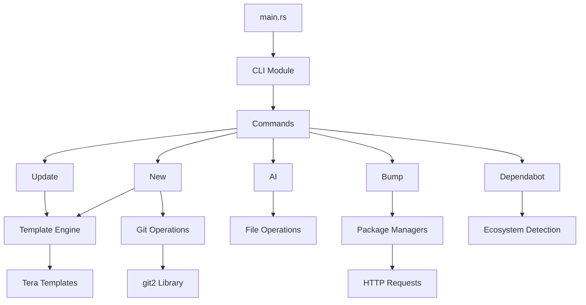
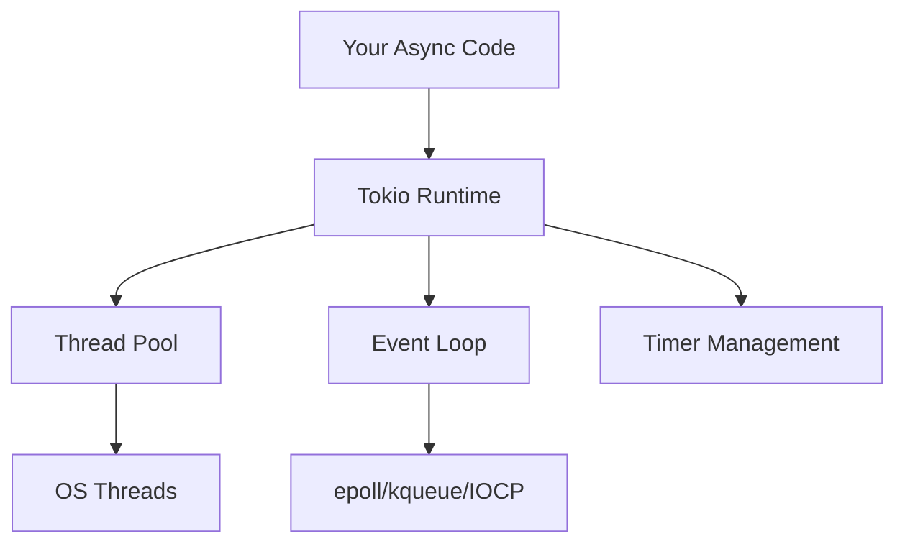
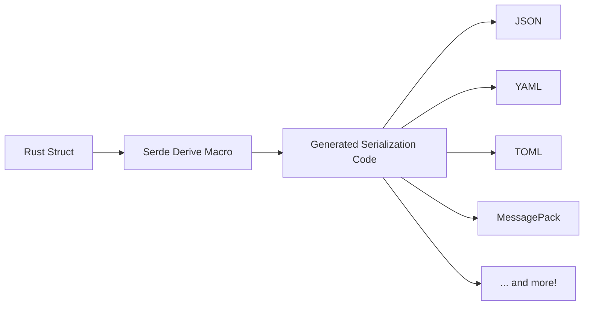
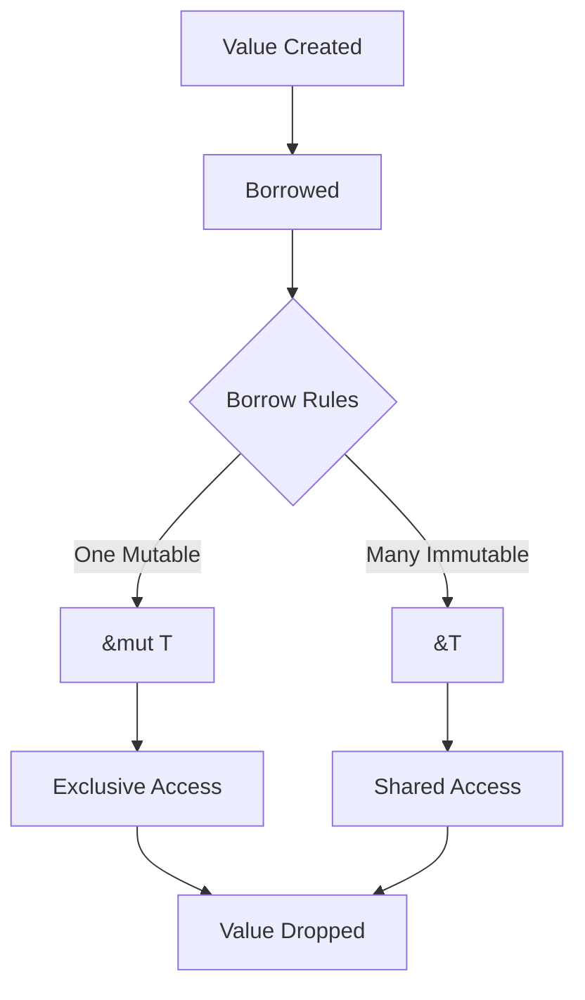
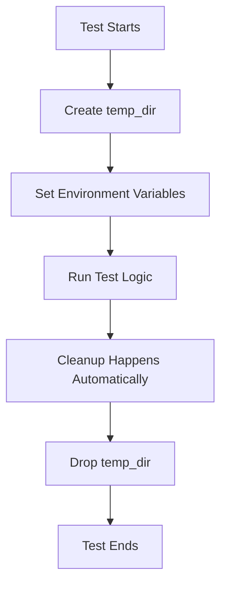

# Learning Rust with Jig: A Somewhat Sardonic Journey

_[imagine a drawing of a fox wearing professor glasses and a mortarboard, holding a pointer at a blackboard covered in Rust symbols]_

## Chapter 0: Why Are We Here?

So you want to learn Rust, do you? Well, you've stumbled upon `jig`, a delightful little tool that manages development environments while simultaneously being a showcase of how to build a real CLI application in Rust. Consider this your guided tour through the labyrinth of lifetimes, the maze of macros, and the... uh... forest of fearless concurrency? (Look, alliteration is hard.)

## Chapter 1: The Architecture of a Rust CLI App

Let's start with how `jig` is structured, because understanding the architecture helps you understand the patterns:



### The Entry Point: main.rs

Every Rust program starts with `main()`, and ours is refreshingly simple:

```rust
use anyhow::Result;
use clap::Parser;
use jig::{cli::Cli, commands};

fn main() -> Result<()> {
    env_logger::init();
    let cli = Cli::parse();

    // Match on commands and execute
    match &cli.command {
        // ... command handling
    }
}
```

See that `Result<()>`? That's Rust's way of saying "this function might fail, and that's okay!" The `anyhow` crate gives us delightful error handling without the boilerplate. It's like having a safety net made of... well, safety.

## Chapter 2: Clap - Making CLIs Not Suck

The `clap` crate is what makes our command-line interface actually pleasant to use. It's declarative, which is a fancy way of saying "you describe what you want, not how to parse it."

```rust
#[derive(Parser, Debug)]
#[command(author, version, about, long_about = None)]
pub struct Cli {
    #[arg(long, short = 'd', global = true)]
    pub dry_run: bool,

    #[command(subcommand)]
    pub command: Commands,
}
```

Those `#[derive]` and `#[command]` things? They're called derive macros, and they're basically code that writes code. Meta, right? Clap looks at your struct and generates all the argument parsing logic at compile time. It's like having a very dedicated intern who never needs coffee.

### Subcommands: The Art of Nesting

```rust
#[derive(Subcommand, Debug)]
pub enum Commands {
    New(NewArgs),
    Update(UpdateArgs),
    Bump(BumpArgs),
    // ... more commands
}
```

Enums in Rust are not your grandmother's enums. They can hold data! Each variant can have different associated data, making them perfect for representing different commands with different arguments.

## Chapter 3: Error Handling - Embracing Failure

Rust doesn't have exceptions. Instead, it has `Result<T, E>`, which is either `Ok(T)` (success!) or `Err(E)` (oops!). The `anyhow` crate makes this ergonomic:

```rust
use anyhow::{Context, Result};

fn do_something_risky() -> Result<String> {
    std::fs::read_to_string("important.txt")
        .context("Failed to read the very important file")?
}
```

That `?` operator is chef's kiss. It says "if this is an error, return it; otherwise, unwrap the value." It's error propagation without the ceremony.

### The Context Trait

`.context()` adds human-readable context to errors. When something goes wrong deep in your code, you get a nice error chain:

```plaintext
Error: Failed to create new project
Caused by:
    0: Failed to read template
    1: No such file or directory (os error 2)
```

It's like breadcrumbs, but for debugging!

## Chapter 4: Templates with Tera

Tera is our template engine, and it's delightfully straightforward:

```rust
let mut tera = Tera::new("templates/**/*")?;
let mut context = Context::new();
context.insert("project_name", &project_name);

let rendered = tera.render("rust/Cargo.toml.tera", &context)?;
```

Templates look like this:

```toml
[package]
name = "{{ project_name|lower|replace(from=' ', to='_') }}"
version = "0.1.0"
```

Those pipes (`|`) are filters. They transform values in useful ways. It's like Unix pipes, but for strings!

### The Power of Filters


Tera comes with tons of built-in filters, and you can even add your own. It's extensibility without the pain!

## Chapter 5: Git Operations with git2

The `git2` crate gives us libgit2 bindings, which means we can do Git operations without shelling out:

```rust
use git2::Repository;

let repo = Repository::init(path)?;
let mut index = repo.index()?;
index.add_all(["*"].iter(), git2::IndexAddOption::DEFAULT, None)?;
```

No more `std::process::Command` shenanigans! It's Git operations with type safety and proper error handling.

### Why Not Shell Out?

You might ask, "Why not just run `git` commands?" Well:

1. **Portability**: Not everyone has `git` in their PATH
2. **Performance**: No process spawning overhead
3. **Type Safety**: The compiler catches your mistakes
4. **Error Handling**: Structured errors instead of parsing stderr

## Chapter 6: Async Rust with Tokio

For the GitHub API operations, we use `octocrab` with `tokio`:

```rust
#[tokio::main]
async fn main() -> Result<()> {
    let octocrab = octocrab::instance();
    let repos = octocrab
        .current()
        .list_repos_for_authenticated_user()
        .send()
        .await?;
}
```

That `async`/`await` syntax? It's Rust's approach to asynchronous programming. The `#[tokio::main]` macro sets up the async runtime. It's like having a personal assistant who juggles all your concurrent tasks.

### The Async Ecosystem



Tokio handles all the gnarly details of async I/O, letting you write code that looks synchronous but runs concurrently. It's magic, but the kind backed by computer science!

## Chapter 7: File System Operations

Rust's standard library has great file operations, but we enhance them with crates like `walkdir`:

```rust
use walkdir::WalkDir;

for entry in WalkDir::new(directory)
    .into_iter()
    .filter_entry(|e| !is_hidden(e))
{
    let entry = entry?;
    // Process each file/directory
}
```

`WalkDir` recursively walks directories, handling all the edge cases. It's like having a very thorough tour guide for your filesystem.

### Path Handling

Rust's `Path` and `PathBuf` types are cross-platform:

```rust
use std::path::{Path, PathBuf};

let config_dir = dirs::config_dir()
    .ok_or_else(|| anyhow!("No config directory"))?;
let our_config = config_dir.join("jig").join("config.toml");
```

No more `/` vs `\` nonsense. Rust handles it for you!

## Chapter 8: Serialization with Serde

Serde is Rust's serialization framework, and it's magnificent:

```rust
#[derive(Serialize, Deserialize)]
struct Config {
    version: u32,
    updates: Vec<UpdateConfig>,
}

let config: Config = serde_yaml::from_str(&yaml_content)?;
let json = serde_json::to_string_pretty(&config)?;
```

One struct, multiple formats. It's like having a universal translator for data!

### The Derive Magic



The derive macros generate all the boring serialization code at compile time. You just annotate your structs and Serde does the rest.

## Chapter 9: Pattern Matching - Rust's Secret Weapon

Pattern matching in Rust is like switch statements on steroids:

```rust
match &cli.command {
    Commands::New(args) => commands::new::run(args, &common_options),
    Commands::Update(args) => commands::update::run(args, &common_options),
    Commands::Bump(args) => match &args.ecosystem {
        Some(BumpEcosystem::Node) => handle_node(),
        Some(BumpEcosystem::Python) => handle_python(),
        None => handle_all(),
    },
}
```

It's exhaustive (the compiler ensures you handle all cases) and can destructure data. It's like having X-ray vision for your data structures!

## Chapter 10: Lifetimes - The Final Boss

Ah, lifetimes. The thing that makes grown developers cry. But they're not that bad, really!

```rust
fn longest<'a>(x: &'a str, y: &'a str) -> &'a str {
    if x.len() > y.len() { x } else { y }
}
```

That `'a` is a lifetime parameter. It says "the returned reference lives as long as both input references." It's Rust's way of preventing dangling pointers without a garbage collector.

### The Borrow Checker



The borrow checker ensures:

1. You can have many immutable references OR one mutable reference
2. References can't outlive their data
3. No data races

It's like having a very strict librarian who ensures nobody tears pages out of the books.

## Chapter 11: Testing in Rust - Where the Rubber Meets the Road

Rust has built-in testing support, and in `jig` we've got 54 tests proving it works:

```rust
#[cfg(test)]
mod tests {
    use super::*;

    #[test]
    fn test_something() {
        assert_eq!(2 + 2, 4);
    }

    #[test]
    #[should_panic(expected = "divide by zero")]
    fn test_panic() {
        let _ = 1 / 0;
    }
}
```

Tests live right next to your code. Run them with `cargo test`. It's testing without the setup hassle!

### Real-World Testing Lessons from Jig

Let's talk about the testing approach in `jig`, because we learned some things the hard way:

#### Environment Variable Testing

```rust
#[test]
fn test_git_signature_with_env_vars() {
    std::env::set_var("GIT_AUTHOR_NAME", "Test Author");
    std::env::set_var("GIT_AUTHOR_EMAIL", "test@example.com");

    let signature = get_signature(repo, &[])?;
    assert_eq!(signature.name(), Some("Test Author"));
}
```

The tricky part? Environment variables are global! We had to fix our git signature logic to prioritize environment variables over global git config. The test was failing because it expected "Test Author" but got "Dave Williams" from the global git config.

#### XDG Configuration Testing

```rust
fn with_temp_config<F, R>(test_fn: F) -> R
where
    F: FnOnce() -> R,
{
    let temp_dir = tempfile::tempdir().unwrap();
    let temp_path = temp_dir.path().to_string_lossy().to_string();

    std::env::set_var("XDG_CONFIG_HOME", &temp_path);
    let result = test_fn();
    std::env::remove_var("XDG_CONFIG_HOME");

    result
}
```

This helper function ensures each test gets its own config directory. We had to fix our path resolution code to properly handle `XDG_CONFIG_HOME` by using `join()` correctly instead of string concatenation.

#### Serde Default Values

```rust
#[derive(Serialize, Deserialize)]
struct UpdateConfig {
    #[serde(skip_serializing_if = "Vec::is_empty", default)]
    pub assignees: Vec<String>,
}
```

That `default` annotation is crucial! Without it, Serde expects the field to be present in the YAML. Our Dependabot tests were failing because some configs had empty assignees arrays while others had none at all.

#### The Art of Temporary Directories



The `tempfile` crate is your friend! It automatically cleans up when the `TempDir` goes out of scope. No more "my test failed because the previous test left files around" nonsense.

#### Path Joining: The Cross-Platform Minefield

```rust
// Wrong! This breaks on Windows
let path = format!("{}/jig/config.yaml", config_dir);

// Right! This works everywhere
let path = config_dir.join("jig").join("config.yaml");
```

We learned this the hard way when our path construction was using forward slashes directly instead of using `PathBuf::join()`. The fix was simple but critical for cross-platform compatibility.

### Test Organization Philosophy

Our tests follow a pattern:

```rust
#[cfg(test)]
mod tests {
    use super::*;
    use tempfile::tempdir;

    fn setup_test_env() -> TestResult {
        // Common setup code
    }

    #[test]
    fn test_the_happy_path() {
        // When everything works
    }

    #[test]
    fn test_the_sad_path() {
        // When things go wrong
    }

    #[test]
    fn test_edge_cases() {
        // The weird stuff
    }
}
```

Each module (`config`, `dependabot`, `git`, `template`, `utils`) has its own test module. This keeps things organized and makes it easy to run just the tests you care about:

```bash
cargo test config::tests  # Just config tests
cargo test -- --nocapture  # See println! output
```

### The Debugging Dance

When tests fail, Rust gives you excellent error messages:

```plaintext
thread 'config::tests::test_config_manager_initialization' panicked at src/config/mod.rs:123:5:
assertion failed: !manager.app_config().ai.tools.is_empty()
```

This tells you exactly where the test failed and what assertion broke. Combined with `--nocapture`, you can debug like a pro.

### Testing Anti-Patterns to Avoid

1. **Global State Pollution**: Don't let tests affect each other
2. **Hardcoded Paths**: Use temp directories and relative paths
3. **Network Dependencies**: Mock external services
4. **Time Dependencies**: Use fixed timestamps in tests
5. **Platform-Specific Logic**: Test abstractions, not implementations

The beauty of Rust testing is that it forces you to think about these things upfront. If your code is hard to test, it's probably poorly designed!

### The Race Condition Reality Check

Speaking of global state pollution, we learned this the hard way! Some of our tests modify environment variables like `XDG_CONFIG_HOME` and `GIT_AUTHOR_*`, and when `cargo test` runs them in parallel (which is the default), they can step on each other's toes.

The solution? Run tests with a single thread when you need to avoid race conditions:

```bash
# This prevents the embarrassing "why do my tests fail sometimes?" moments
cargo test -- --test-threads=1
```

It's slower, but it's deterministic. And as we all know, slow and correct beats fast and broken every time!

This is a classic example of how real-world software development teaches you things that no tutorial ever mentions. Environment variables are global! Who knew? (Everyone who's been bitten by this before, that's who.)

## Chapter 12: Modules and Visibility

Rust's module system is... unique:

```rust
// In lib.rs
pub mod commands {
    pub mod new;
    pub mod update;

    // Private helper
    fn shared_logic() {}
}
```

`pub` makes things public. No `pub`? It's private. Simple! Well, until you learn about `pub(crate)`, `pub(super)`, and... okay, it's not that simple, but it's powerful!

## Chapter 13: The Magic of Macros

We use macros to reduce boilerplate:

```rust
macro_rules! handle_command {
    ($cmd:expr, $handler:expr) => {
        if $cli.dry_run {
            println!("Would execute: {}", $cmd);
        } else {
            $handler?;
        }
    };
}
```

Macros are code that generates code. They're like templates for your templates. Meta-meta-programming!

## Chapter 14: Dependencies and Cargo

Our `Cargo.toml` is a testament to Rust's ecosystem:

```toml
[dependencies]
clap = { version = "4.5", features = ["derive"] }
tokio = { version = "1.0", features = ["full"] }
serde = { version = "1.0", features = ["derive"] }
```

Cargo handles:

- Dependency resolution
- Building
- Testing
- Documentation
- Publishing

It's like having a Swiss Army knife for Rust development!

## Chapter 15: Performance Considerations

Rust gives you control over performance:

1. **Zero-cost abstractions**: You don't pay for what you don't use
2. **No garbage collector**: Predictable performance
3. **Inline everything**: The compiler is aggressive about optimization
4. **SIMD when possible**: Modern CPU features, automatically

```rust
// This compiles to the same assembly as hand-written C
let sum: i32 = numbers.iter().sum();
```

## Conclusion: What Have We Learned?

Through `jig`, we've explored:

- CLI parsing with Clap
- Error handling with anyhow
- Template engines with Tera
- Git operations with git2
- Async programming with Tokio
- File operations with walkdir
- Serialization with Serde
- And so much more!

Rust is a language that respects you enough to give you power, but also cares enough to keep you safe. It's like having a very competent butler who also happens to be a ninja.

Remember: the compiler is your friend. When it complains, it's not being mean - it's saving you from future debugging sessions at 3 AM.

Happy coding, you magnificent rustacean!

_[imagine a drawing of the fox professor taking a bow, with a graduation cap being thrown in the air]_
