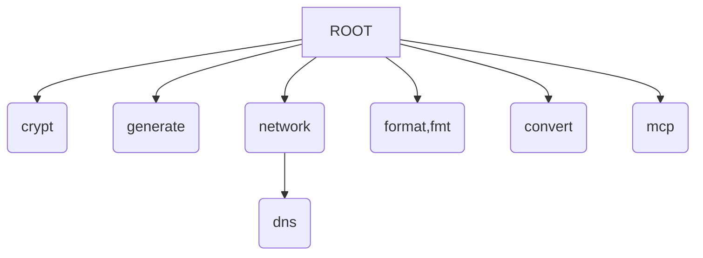

# Implementation Plan: `jig`

## NOTES

- Encryption and decryption with `age` via `rage`
  - <https://github.com/str4d/rage>
- can we have it so you only need to type enough of a command to disambiguate it? Could bodge this with aliases at a push.

## Command Tree

