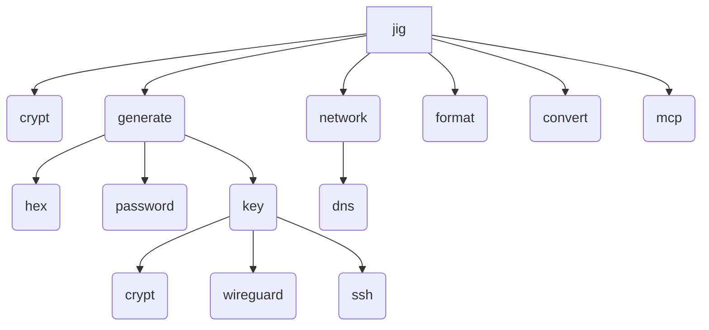

# Implementation Plan: `jig`

## Layout

- Base CLI framework with `clap`
  - <https://github.com/clap-rs/clap>
  - Supports command shortening to disambiguation
    - Derive API: `#[command(infer_subcommands = true)]`
  - `jig fmt` is an alias for `jig format`
- Terminal UI with `ratatui`
  - <https://github.com/ratatui/ratatui>
- Encryption and decryption with `age` via `rage`
  - <https://github.com/str4d/rage>

## Command Tree

