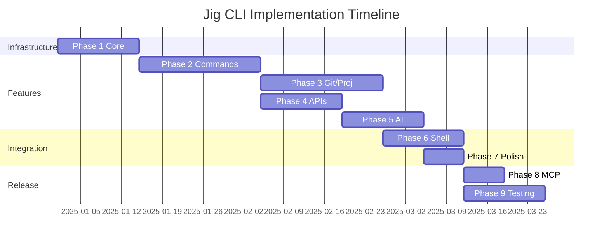

# Jig CLI - Enhanced Implementation Plan

This document outlines the phased implementation plan for the `jig` CLI toolbox, based on the features described in the `README.md`. The project is broken down into logical phases to ensure a structured development process, starting with core infrastructure and progressively adding more complex features.

## Phase Dependencies & Timeline

## Phase 1: Core Infrastructure & Project Setup

**Goal:** Establish the foundational components of the application. This includes the command-line argument parsing, configuration management, and essential shared utilities that all other commands will rely on.

**Duration:** 2 weeks

**Dependencies:** None

- [ ] **CLI Framework (`clap`):**
    - [ ] Set up the main `jig` command structure with subcommands
    - [ ] Implement all global options: `--version`, `--help`, `--yes`, `--json`, `--verbose`, `--quiet`, `--silent`
    - [ ] Configure `clap` to allow command abbreviation
    - [ ] Set up proper error propagation with `anyhow` or custom error types

- [ ] **Configuration (`saphyr`, `serde`):**
    - [ ] Implement loading of `~/.jig.yaml`
    - [ ] Implement loading and merging of the optional `~/.jig.secret.yaml`
    - [ ] Implement the hierarchical secret resolution logic (`secret.main`, `secret.jwt`) supporting `key`, `file`, and `env` sources
    - [ ] Create configuration validation layer
    - [ ] Implement configuration defaults

- [ ] **Core Utilities:**
    - [ ] Create a shared module for common utilities
    - [ ] Implement the Git abstraction layer to allow switching between the `git` CLI and the `gix` library based on `git.internal` config
    - [ ] Set up a consistent error handling and logging strategy using `tracing`
    - [ ] Implement the `resolve_github_username` utility
    - [ ] Create output formatting utilities for JSON/human-readable output

## Phase 2: Foundational Command Groups

**Goal:** Implement the core, self-contained utility commands that provide immediate value and do not have significant external dependencies.

**Duration:** 3 weeks

**Dependencies:** Phase 1 complete

- [ ] **`jig crypto`:**
    - [ ] `encrypt`: Implement `age` encryption for files and stdin
    - [ ] `decrypt`: Implement `age` decryption for files and stdin
    - [ ] `public`: Implement public key derivation from a private key
    - [ ] Add comprehensive error handling for invalid keys
    - [ ] Support binary input/output handling

- [ ] **`jig generate`:**
    - [ ] `hex`: Implement cryptographically secure hex string generation
    - [ ] `password`: Implement secure password generation, including `xkcd` mode and entropy validation with `zxcvbn`
    - [ ] `key crypto`: Implement `age` key pair generation
    - [ ] `key wireguard`: Implement WireGuard key pair generation
    - [ ] `jwt`: Implement JWT generation with configurable claims, expiry, and secret handling
    - [ ] Add deterministic generation support with `--keyed` and `--seed` options

- [ ] **`jig network` & `jig tls`:**
    - [ ] `network dns flush`: Implement OS-aware DNS cache flushing
    - [ ] `network dns lookup`: Implement DNS queries with custom server support
    - [ ] `network dns sec`: Implement DNSSEC validation checks
    - [ ] `tls cert`: Implement TLS certificate retrieval
    - [ ] `tls ciphers`: Implement listing of supported TLS cipher suites
    - [ ] Add timeout handling for network operations

## Phase 3: Project & Git Management

**Goal:** Build the commands for managing projects and interacting with Git repositories. These are more complex and involve filesystem manipulation and external process execution.

**Duration:** 3 weeks

**Dependencies:** Phase 1 complete

- [ ] **`jig project template`:**
    - [ ] `list`: List available templates from the local cache
    - [ ] `update`: Update the local template cache from the configured Git repository
    - [ ] `new`: Create a new, empty template structure with a `.jig.template.yaml`
    - [ ] Implement `_shared` template support

- [ ] **`jig project`:**
    - [ ] `new`: Scaffold a new project from a Tera template, including `.jig.yaml` tracking file creation
    - [ ] `update`: Apply updates from a template to an existing project, showing diffs
    - [ ] `dependabot`: Generate `.github/dependabot.yml` based on detected project ecosystems
    - [ ] `bump`: Implement dependency version bumping for `Cargo.toml`, `package.json`, and GitHub Actions
    - [ ] Add Tera template context with project metadata

- [ ] **`jig git`:**
    - [ ] `clone`: Implement simplified `username/repo` cloning
    - [ ] `latest`: Get the latest commit hash for a branch from GitHub
    - [ ] `secret`: Manage GitHub Actions secrets via the API
    - [ ] `yank`: Implement batch fetch/pull for all repos in a directory
    - [ ] Add progress indicators for long operations

- [ ] **`jig git binary`:**
    - [ ] Implement metadata storage in `~/.local/share/jig/binaries.yaml`
    - [ ] `get`: Download, install, and record binary releases from GitHub
    - [ ] `show`: Display information about installed binaries
    - [ ] `update`: Update binaries to their latest versions
    - [ ] `remove`: Uninstall binaries and clean up metadata
    - [ ] Add architecture detection and binary selection logic

## Phase 4: External API Integration

**Goal:** Implement features that rely on external APIs (`dave.io`, Domainr, RDAP).

**Duration:** 2 weeks

**Dependencies:** Phase 2 partially complete

**Can run in parallel with:** Phase 3

- [ ] **`jig api` (Core):**
    - [ ] Create a base API client for `https://dave.io/` with retry logic
    - [ ] `ping`: Implement the API health check
    - [ ] `token info`: Retrieve token details
    - [ ] `token revoke`: Revoke an API token
    - [ ] `token usage`: View token usage statistics
    - [ ] Add proper authentication header handling

- [ ] **`jig domain`:**
    - [ ] `check`: Implement domain availability check using the Domainr API
    - [ ] `expiry`: Implement domain expiration check using an RDAP client
    - [ ] `ns`: Implement nameserver lookup using RDAP with a DNS fallback
    - [ ] Add caching layer for API responses
    - [ ] Implement Cloudflare TLD filtering

## Phase 5: AI-Powered Features

**Goal:** Integrate with AI services (Claude) to deliver intelligent automation features.

**Duration:** 2 weeks

**Dependencies:** Phase 4 complete (for API client)

- [ ] **Shared AI Utilities:**
    - [ ] Implement the `prepare_image_for_claude` utility for image resizing and optimization
    - [ ] Implement the `ask_claude` helper function for sending prompts and data
    - [ ] Add retry logic and error handling for AI API calls

- [ ] **AI Commands:**
    - [ ] `jig ai rename image`: Implement AI-powered image renaming
    - [ ] `jig git commit`: Implement AI-generated conventional commit messages from diffs
    - [ ] `jig api image alt`: Generate alt text for images
    - [ ] `jig api image optimise`: Optimize images via the API
    - [ ] `jig api ticket title`: Generate ticket titles from descriptions
    - [ ] `jig api ticket description`: Generate ticket descriptions from titles
    - [ ] `jig api ticket enrich`: Design and implement enrichment logic
    - [ ] Add rate limiting and quota management

## Phase 6: Advanced Shell & System Integration

**Goal:** Implement features that require deep integration with the user's shell and local environment.

**Duration:** 2 weeks

**Dependencies:** Phases 1-3 complete

- [ ] **`jig init`:**
    - [ ] Implement the full initialization flow: directory creation, template cloning, config generation, and shell integration checks
    - [ ] Add shell detection logic
    - [ ] Generate shell-specific installation instructions

- [ ] **`jig workspace`:**
    - [ ] `list`: Implement listing of configured workspaces
    - [ ] `switch`: Implement the complete state transition logic, including running `up`/`down` commands and managing environment variables
    - [ ] `hook`: Implement the shell-specific hook for prompt integration and automatic environment management
    - [ ] Add fish shell support with proper variable handling
    - [ ] Add bash/zsh compatibility layer
    - [ ] Implement environment variable isolation

- [ ] **`jig terminal`:**
    - [ ] `sysinfo`: Display system info gauges using `viuer`
    - [ ] `xkcd`: Fetch and display XKCD comics in the terminal
    - [ ] Add terminal capability detection
    - [ ] Implement fallback rendering modes

## Phase 7: Polish & Easter Eggs

**Goal:** Add features that enhance the user experience but are not critical to core functionality.

**Duration:** 1 week

**Dependencies:** Phase 6 complete

- [ ] **`jig dance`:**
    - [ ] Integrate the various terminal effects libraries (`tachyonfx`, `tui-rain`, etc.)
    - [ ] Design and implement the animation sequence
    - [ ] Hide the command from `--help` output
    - [ ] Add interrupt handling for clean exit
    - [ ] Implement multiple animation modes

## Phase 8: Future & Protocol Implementation

**Goal:** Implement forward-looking features planned for after the initial release.

**Duration:** 1 week (initial implementation)

**Dependencies:** Most other phases complete

- [ ] **`jig mcp`:**
    - [ ] Implement the Model Context Protocol server using `rmcp`
    - [ ] Define and document the protocol for exposing `jig` commands to AI agents
    - [ ] Create security boundaries for MCP access
    - [ ] Add command filtering and permission system
    - [ ] (Note: This is a post-v1.0 feature as per the README)

## Phase 9: Testing, Documentation & Release

**Goal:** Finalize the application for a public release.

**Duration:** 2 weeks

**Dependencies:** All feature phases complete

**Should run continuously:** Throughout development

- [ ] **Testing:**
    - [ ] Write unit tests for all core logic (crypto, generation, etc.)
    - [ ] Write integration tests for the CLI to validate command execution and output
    - [ ] Add property-based testing for generation utilities
    - [ ] Create end-to-end test scenarios
    - [ ] Add performance benchmarks

- [ ] **CI/CD:**
    - [ ] Configure `ci.yaml` to run tests, `rustfmt`, and `clippy` on all pushes
    - [ ] Create a release workflow to build cross-platform binaries and publish them to GitHub Releases
    - [ ] Add code coverage reporting
    - [ ] Set up dependency vulnerability scanning

- [ ] **Documentation:**
    - [ ] Thoroughly review and update the `README.md` to ensure it is accurate
    - [ ] Verify that all `--help` messages are clear, correct, and comprehensive
    - [ ] Create man pages for each command
    - [ ] Add example usage documentation
    - [ ] Create troubleshooting guide

- [ ] **Packaging:**
    - [ ] Ensure the project is correctly configured for `cargo install`
    - [ ] Create and test the Homebrew tap formula
    - [ ] Add shell completion files
    - [ ] Create Docker image (optional)
    - [ ] Set up binary signing for releases

## Risk Mitigation Strategies

1. **External API Dependencies**: Implement proper fallbacks and offline modes where possible
2. **Shell Integration Complexity**: Start with fish shell (your primary), then expand to others
3. **AI Feature Costs**: Add usage tracking and warnings for AI-powered features
4. **Cross-Platform Compatibility**: Use CI to test on multiple OS/architecture combinations
5. **Binary Size**: Monitor and optimize dependencies to keep binary size reasonable

## Success Metrics

- All commands work as documented in README
- < 100ms startup time for simple commands
- < 5MB binary size (compressed)
- 80%+ test coverage
- Zero security vulnerabilities
- Compatible with macOS, Linux, and Windows

## Post-Launch Roadmap

1. WASM compilation for browser usage
2. Remote MCP server implementation
3. Plugin system for custom commands
4. GUI wrapper (optional)
5. Mobile companion app (optional)
