# `jig` - A CLI Toolbox

[](https://deepwiki.com/daveio/jig)

## Project

`jig` is a utility which collects tools for various tasks into one place. It merges all my disparate tools into a single
CLI toolbox, making it easier to manage and use them, and teaches me Rust.

Will also include shell plugins. Support for **standalone installation**, or using:

- `fish`: `fisher`, `oh-my-fish`, `fundle`, `fisherman`
- `zsh`: `antigen`, `antidote`, `antibody`, `zplug`, `zplugin`, `oh-my-zsh`
- `bash`: `bash-it`, `oh-my-bash`

Shell plugin features:

- Directory creation / ensuring
- `jig workspace hook` integration
- `$PATH` / `$fish_user_paths` setup
- Keeping any supporting artifacts in `~/.local/share/jig` (wordlists?) up to date
- Completion (do we get this for free with `clap`?)

## Command Tree

```mermaid
---
config:
  layout: elk
  theme: dark
---
graph LR
  jig[jig]
    jig --> init(init)
    jig --> crypto(crypto)
      crypto --> cryptoEncrypt(encrypt)
      crypto --> cryptoDecrypt(decrypt)
      crypto --> cryptoPublic(public)
    jig --> generate(generate)
      generate --> generateHex(hex)
      generate --> generatePassword(password)
      generate --> generateKey(key)
      generateKey --> generateKeyCrypto(crypto)
      generateKey --> generateKeyWireguard(wireguard)
      generate --> generateJwt(jwt)
    jig --> network(network)
      network --> networkDns(dns)
        networkDns --> networkDnsFlush(flush)
        networkDns --> networkDnsLookup(lookup)
        networkDns --> networkDnsSec(sec)
    jig --> domain(domain)
      domain --> domainCheck(check)
      domain --> domainExpiry(expiry)
      domain --> domainNs(ns)
    jig --> tls(tls)
      tls --> tlsCert(cert)
      tls --> tlsCiphers(ciphers)
    jig --> api(api)
      api --> apiTicket(ticket)
        apiTicket --> apiTicketTitle(title)
        apiTicket --> apiTicketDescription(description)
        apiTicket --> apiTicketEnrich(enrich)
      api --> apiImage(image)
        apiImage --> apiImageAlt(alt)
        apiImage --> apiImageOptimise(optimise)
      api --> apiToken(token)
        apiToken --> apiTokenInfo(info)
        apiToken --> apiTokenRevoke(revoke)
        apiToken --> apiTokenUsage(usage)
      api --> apiPing(ping)
    jig --> mcp(mcp)
    jig --> dance(dance)
    jig --> terminal(terminal)
      terminal --> terminalXKCD(xkcd)
    jig --> project(project)
      project --> projectNew(new)
      project --> projectUpdate(update)
      project --> projectBump(bump)
      project --> projectDependabot(dependabot)
      project --> projectTemplate(template)
        projectTemplate --> projectTemplateList(list)
        projectTemplate --> projectTemplateNew(new)
        projectTemplate --> projectTemplateUpdate(update)
    jig --> git(git)
      git --> gitClone(clone)
      git --> gitBinary(binary)
        gitBinary --> gitBinaryGet(get)
        gitBinary --> gitBinaryUpdate(update)
        gitBinary --> gitBinaryShow(show)
        gitBinary --> gitBinaryRemove(remove)
      git --> gitSecrets(secrets)
      git --> gitCommit(commit)
      git --> gitYank(yank)
      git --> gitLatest(latest)
    jig --> workspace(workspace)
      workspace --> workspaceSwitch(switch)
      workspace --> workspaceList(list)
      workspace --> workspaceHook(hook)
    jig --> ai(ai)
      ai --> aiRename(rename)
        aiRename --> aiRenameImage(image)

  style dance stroke-dasharray: 2 3,stroke-width: 5px

```



## Config

Config is in `yaml` format. We use `saphyr` with `serde` for YAML operations.

### Full Config

```yaml
api: #                          API key configuration. optional.
  domainr: DOMAINR_API_KEY #      def: none. optional.
dns: #                          DNS configuration. optional.
  nameserver: 8.8.8.8 #           def: system resolver. optional.
git: #                          Git configuration. optional.
  commit: #                       Git commit configuration. optional.
    after: null #                   def: null. a custom commit message suffix.
    before: null #                  def: null. a custom commit message prefix.
    prefixes: #                     def: stated. conventional commit prefixes. optional.
      - docs
      - feat
      - fix
      - perf
      - refactor
      - style
      - test
    internal: true #              def: true. use gix for git. optional.
    user: daveio #                def: none. GitHub username. optional.
  internal: true #                def: true. use gix for git. optional.
  user: daveio #                  def: none. GitHub username. optional.
project: #                      Project management configuration. optional.
  dependabot: #                   def: stated. Template for each ecosystem. optional.
    #                             `ecosystem` and `directory` are generated.
    schedule:
      interval: daily
    open-pull-requests-limit: 100
    assignees:
      - daveio
    groups:
      all-dependencies:
        patterns:
          - "*"
secret: #                       We use a secret in many places. required.
  file: ~/.jig.secrets #          def: none. keep secrets in a separate file. optional.
  #                               remaining secret configuration is ignored if set.
  #                               this is useful for things like `chezmoi`, allowing
  #                               you to encrypt your secrets file but keep the main
  #                               configuration in plaintext.
  main: #                         main private key. required.
    env: JIG_SECRET_KEY #           def: JIG_SECRET_KEY. optional.
    file: ~/.jig.secret.key #       def: none. file containing key. optional.
    key: AGE-SECRET-KEY-[...] #     def: generated. unencrypted key. required.
    order: #                        def: env, file, key. first wins. optional.
      - env #                         top priority
      - file #                        second priority
      - key #                         final priority
  jwt: #                          JWT configuration. optional.
    env: JIG_JWT_SECRET #           def: JIG_JWT_SECRET. optional.
    file: ~/.jig.jwt.key #          def: none. file containing key. optional.
    key: JWT_SECRET_VALUE #         def: resolved secret from below. optional.
    order: #                        def: env, file, key. first wins. optional.
      - env #                         top priority
      - file #                        second priority
      - key #                         final priority
template: #                     Template configuration. optional.
  branch: template #              def: main. branch to use for templates. optional.
  repository: daveio/jig #        def: daveio/jig. repository for templates. optional.
yank: #                         Yank configuration. optional.
  dir: ~/src #                    def: none. dir to yank in, with repos in subdirs. optional.
```

### Minimal Config

```yaml
secret:
  key: AGE-SECRET-KEY-[...]
```

## Library Notes

- `rmcp`
  - <https://hackmd.io/@Hamze/SytKkZP01l>
- `serde`
  - YAML: <https://lib.rs/crates/saphyr>
  - Other formats: <https://serde.rs/#data-formats>
- `spinoff`
  - `noise`: single character fade spinner
  - `aesthetic`: multi character spinner

## Shared Utilities

### `prepare_image_for_claude`

Shrinks images to under 5 MB for Claude compatibility.

- If image is over `2048px` on the long edge, resize to `2048px` on the long edge.
- Convert to WebP format with `image-webp`.
  - Start with lossless compression.
  - If still over 5 MB, use lossy compression with a quality of 90.
  - If still over 5 MB, use lossy compression with a quality of 75.
  - If still over 5 MB, use lossy compression with a quality of 50.
  - If still over 5 MB, use lossy compression with a quality of 25.
  - Abort with an error.
- If successful, return WebP image data as struct or bytes.

### `ask_claude`

- `PROMPT` - Prompt to send to Claude.
- `ASSOCIATED_DATA` - Associated data to send to Claude. Optional.
- `IMAGE` | `FILENAME` - Image data to send to Claude. Optional.

Calls `prepare_image_for_claude` to ensure the image is compatible, then sends the prompt, associated data, and any
image to Claude.

### `resolve_github_username`

Gets the current user's GitHub username.

- If `git.user` is set in the config, returns that.
- If not, tries to run `gh api user --jq .login` to get the username.
- If that fails, returns an error.

### Git abstraction

We want an abstraction over Git, so we can call the same code whether we're using the `git` CLI or the [
`gix`](https://lib.rs/crates/gix) library, and have the abstraction decide what to do.

## Commands

`clap` supports command shortening to the point of disambiguation.

```rust
// Clap Derive API
#[command(infer_subcommands = true)]
struct Cli {}
```

### `jig ai`

AI-powered utilities.

#### `jig ai rename`

AI renaming operations.

##### `jig ai rename image`

AI-powered image renaming.

- `[FILENAME_OR_GLOB]`: File or glob pattern to rename images. Defaults to all `*.jpg`, `*.jpeg`, `*.png`, `*.webp` in
  the current directory. Multiple filenames/globs can be specified.

Flow:

- Use the `ask_claude` utility to send an image to Claude for filename generation.
  - Syntax: `a_few_words-YYYYMMDD-HHMMss.ext`
- Rename the image.
- Throw away any temp files.

### `jig api`

Call the `dave.io` API.

Base URL: `https://dave.io/`

#### `jig api image`

Image processing operations.

##### `jig api image alt`

Generate alt text for images.

Flow:

- Puts the image through `prepare_image_for_claude`.
- Sends it to `/api/ai/alt` via POST.

##### `jig api image optimise`

Optimise image files.

Flow:

- Sends image to `/api/images/optimise` via POST.

#### `jig api ping`

API health checks.

Flow:

- Dead simple. Fetches `/api/ping` and shows the data from the response.
  - The API returns JSON.

#### `jig api ticket`

Ticket management operations.

##### `jig api ticket description`

Generate ticket descriptions from a title.

- `[TITLE]`: Title of the ticket to generate a description for. Required.
- `-i` / `--input`: File containing the title. Optional.
- `-s` / `--stdin`: Read title from `stdin`. Optional.

Flow:

- Calls `/api/tickets/description` with the title.

##### `jig api ticket enrich`

Enrich ticket information.

##### `jig api ticket title`

Generate ticket title from a description.

- `[DESCRIPTION]`: Description of the ticket to generate a title for. Required.
- `-i` / `--input`: File containing the description. Optional.
- `-s` / `--stdin`: Read description from `stdin`. Optional.

Flow:

- Calls `/api/tickets/title` with the description.

#### `jig api token`

Token management operations.

##### `jig api token info`

Get token information.

- `[UUID]`: Token UUID to get information for. Required.

Flow:

- Calls `/api/tokens/$UUID` with the UUID.

##### `jig api token revoke`

Revoke tokens.

- `[UUID]`: Token UUID to revoke. Required.

Flow:

- Calls `/api/tokens/$UUID/revoke` with the UUID.

##### `jig api token usage`

Check token usage.

- `[UUID]`: Token UUID to get usage information for. Required.

Flow:

- Calls `/api/tokens/$UUID/usage` with the UUID.

### `jig crypto`

Encryption and decryption operations.

#### `jig crypto decrypt`

`-i` / `--input`: File of ciphertext to read.
`-o` / `--output`: File of plaintext to write. May be binary.
`-k` / `--key` `[KEY]`: Override key from configuration or env.

Decrypt data using `age` encryption.

Default: ciphertext in via `stdin`, plaintext out via `stdout`, information via `stderr`.

#### `jig crypto encrypt`

`-i` / `--input`: File of plaintext to read. May be binary.
`-o` / `--output`: File of ciphertext to write.
`-k` / `--key` `[KEY]`: Override key from configuration or env.

Encrypt data using `age` encryption.

Default: plaintext in via `stdin`, ciphertext out via `stdout`, information via `stderr`.

#### `jig crypto public`

`-k` / `--key` `[KEY]`: Private key to process

Prints the public key ('recipient' in `age` terms) associated with a private key. Uses the configured private key by
default.

### `jig dance`

Easter egg command with terminal effects.

- Not present in `--help`.
- Not exposed via MCP.

See [Easter Egg Nonsense](#easter-egg-nonsense) for more details.

### `jig domain`

Domain management and information tools.

#### `jig domain check`

- `-d` / `--domaincheck`: Shell out to `domaincheck`. Must be installed and on `$PATH`.
- `[QUERY]`: Domain query. Required.

Check domain availability.

Flow:

- Use the Domainr API with RapidAPI credentials.
- Consider only TLDs on the 'Cloudflare TLDs' list.

Improvements:

- Extract logic from `domaincheck` CLI crate.

**Cloudflare TLDs:**

> `ac` `academy` `accountant` `accountants` `actor` `adult` `agency` `ai` `airforce` `apartments` `app` `army`
> `associates` `attorney` `auction` `audio` `baby` `band` `bar` `bargains` `beer` `bet` `bid` `bike` `bingo` `biz` `black`
> `blog` `blue` `boo` `boston` `boutique` `broker` `build` `builders` `business` `cab` `cafe` `cam` `camera` `camp`
> `capital` `cards` `care` `careers` `casa` `cash` `casino` `catering` `cc` `center` `ceo` `chat` `cheap` `christmas`
> `church` `city` `claims` `cleaning` `clinic` `clothing` `cloud` `club` `co` `co.uk` `coach` `codes` `coffee` `college`
> `com` `com.ai` `com.co` `community` `company` `compare` `computer` `condos` `construction` `consulting` `contact`
> `contractors` `cooking` `cool` `coupons` `credit` `creditcard` `cricket` `cruises` `dad` `dance` `date` `dating` `day`
> `dealer` `deals` `degree` `delivery` `democrat` `dental` `dentist` `design` `dev` `diamonds` `diet` `digital` `direct`
> `directory` `discount` `doctor` `dog` `domains` `download` `education` `email` `energy` `engineer` `engineering`
> `enterprises` `equipment` `esq` `estate` `events` `exchange` `expert` `exposed` `express` `fail` `faith` `family` `fan`
> `fans` `farm` `fashion` `feedback` `finance` `financial` `fish` `fishing` `fit` `fitness` `flights` `florist` `flowers`
> `fm` `foo` `football` `forex` `forsale` `forum` `foundation` `fun` `fund` `furniture` `futbol` `fyi` `gallery` `game`
> `games` `garden` `gifts` `gives` `glass` `global` `gmbh` `gold` `golf` `graphics` `gratis` `green` `gripe` `group`
> `guide` `guitars` `guru` `haus` `health` `healthcare` `help` `hockey` `holdings` `holiday` `horse` `hospital` `host`
> `hosting` `house` `how` `icu` `immo` `immobilien` `inc` `industries` `info` `ink` `institute` `insure` `international`
> `investments` `io` `irish` `jetzt` `jewelry` `kaufen` `kim` `kitchen` `land` `lawyer` `lease` `legal` `lgbt` `life`
> `lighting` `limited` `limo` `link` `live` `loan` `loans` `lol` `love` `ltd` `luxe` `maison` `management` `market`
> `marketing` `markets` `mba` `me` `me.uk` `media` `memorial` `men` `miami` `mobi` `moda` `mom` `money` `monster`
> `mortgage` `mov` `movie` `navy` `net` `net.ai` `net.co` `net.uk` `network` `new` `news` `nexus` `ngo` `ninja` `nom.co`
> `observer` `off.ai` `ong` `online` `org` `org.ai` `org.uk` `organic` `page` `partners` `parts` `party` `pet` `phd`
> `photography` `photos` `pics` `pictures` `pink` `pizza` `place` `plumbing` `plus` `porn` `press` `pro` `productions`
> `prof` `promo` `properties` `protection` `pub` `racing` `realty` `recipes` `red` `rehab` `reise` `reisen` `rent`
> `rentals` `repair` `report` `republican` `rest` `restaurant` `review` `reviews` `rip` `rocks` `rodeo` `rsvp` `run`
> `sale` `salon` `sarl` `school` `schule` `science` `security` `select` `services` `sex` `sh` `shoes` `shop` `shopping`
> `show` `singles` `site` `ski` `soccer` `social` `software` `solar` `solutions` `soy` `space` `storage` `store` `stream`
> `studio` `style` `supplies` `supply` `support` `surf` `surgery` `systems` `tax` `taxi` `team` `tech` `technology`
> `tennis` `theater` `theatre` `tienda` `tips` `tires` `today` `tools` `tours` `town` `toys` `trade` `trading` `training`
> `travel` `tv` `uk` `university` `uno` `us` `vacations` `ventures` `vet` `viajes` `video` `villas` `vin` `vip` `vision`
> `vodka` `voyage` `watch` `webcam` `website` `wedding` `wiki` `win` `wine` `work` `works` `world` `wtf` `xxx` `xyz`
> `yoga` `zone`

#### `jig domain expiry`

Check domain expiration dates.

- `[DOMAIN]`: Domain to check. Required.

Use RDAP with `rdap-icann-client`.

If RDAP fails, provide a clickable URL for WHOIS.

#### `jig domain ns`

Check nameserver information.

- `[DOMAIN]`: Domain to check. Required.

Use RDAP with `rdap-icann-client`.

If RDAP fails, do a NS lookup.

### `jig generate`

Generation utilities.

`generate` can be deterministic with `-k` / `--keyed` `[name]`

- Uses encryption key and `[name]` to generate deterministic output
- Use `-s` / `--seed` `[value]` to use custom value instead of encryption key
  - Run `argon2` on `[value]` to get data to actually use

#### `jig generate hex`

- `[LENGTH]`: hex length to generate. Defaults to 16 bytes / 32 chars.

Generate cryptographically secure random hexadecimal values.

#### `jig generate jwt`

Generate JSON Web Tokens.

Applies random UUID as token ID using [`uuid`](https://lib.rs/crates/uuid).

- `--subject [subject]`: Token subject (e.g., "ai:alt", "api:tokens", required)
- `--description [text]`: Human-readable token desc (default: generated)
- `--expiry [duration]`: Expiration time (e.g., "1h", "7d", "30m", default: 1h)
- `--claim [key=value]`: Add custom claims, can be specified multiple times
- `--secret [secret]`: JWT signing secret (or use config/env)
- `--algorithm [alg]`: Signing algorithm (default: HS256)

Secret priority:

- `--secret`
- JWT secret resolution from config
- Return an error

#### `jig generate key`

Generate cryptographic keys.

##### `jig generate key crypto`

`-s` / `--set`: Sets key in configuration file after generation.

Generate encryption keys for native `age`-based encryption.

##### `jig generate key wireguard`

Generate WireGuard private and public keys.

#### `jig generate password`

- `-e` / `--emoji`: Include emoji. Experimental. Uses a subset of non-ZWJ emoji from the RGI list. Warns user to be able
  to reset their password if the site doesn't use Unicode for passwords. Emoji count as one character.
- `-x` / `--xkcd`: Use `correct horse battery staple` format from [xkcd](https://xkcd.com/936). Uses `chbs`.
- `[LENGTH]`: password length to generate. Defaults to 16. In `--xkcd` mode, the number of words, defaulting to 4.

Generate cryptographically secure random passwords with a safe alphabet.

Prints password entropy and general security at the end with `zxcvbn` and `chbs`. Repeats until the `zxcvbn` score is
above `2`, telling the user what is going on.

A minimum of one item from each of the four (five if emoji is enabled) character sets.

Alphabet: `A-Z`, `a-z`, `0-9`, `@%^-_,.~`

With `--emoji`: Also include single-width non-ZWJ, RGI emoji

Emoji list: 😀, 😃, 😄, 😁, 😆, 😅, 😂, 🤣, 😊, 😇, 🙂, 🙃, 😉, 😌, 😍, 🥰, 😘, 😗, 😙, 😚, 😋, 😛, 😜, 🤪, 😝, 🤑, 🤗, 🤭, 🤫, 🤔, 🤐, 🤨, 😐, 😑, 😶, 😏,
😒, 🙄, 😬, 🤥, 😌, 😔, 😪, 🤤, 😴, 😷, 🤒, 🤕, 🤢, 🤮, 🤧, 🥵, 🥶, 🥴, 😵, 🤯, 🤠, 🥳, 😎, 🤓, 🧐, 😕, 😟, 🙁, ☹️, 😮, 😯, 😲, 😳, 🥺, 😦, 😧, 😨, 😰, 😥,
😢, 😭, 😱, 😖, 😣, 😞, 😓, 😩, 😫, 🥱, 😤, 😡, 😠, 🤬, 😈, 👿, 💀, ☠️, 💩, 🤡, 👹, 👺, 👻

### `jig git`

Git and GitHub utilities.

#### `jig git binary`

Information about binaries is kept in `~/.local/share/jig/binaries.yaml` for use by the subcommands. Data format is [
`yaml` using `saphypr`](https://lib.rs/crates/saphypr).

`~/.local/share/jig/bin` is added/ensured to the user's `$PATH` as part of the shell integration hook in
`jig workspace hook`.

Binary file management.

##### `jig git binary get`

**Alias:** `jig git binary install`, `jig git binary add`

Install binary files. Prints path to installed binary.

- Uses the GitHub API to find releases for the specified repository.
  - If no releases are found, returns an error.
- Fetches the latest release for the user's operating environment.
- Installs it to `~/.local/share/jig/bin`.

Saves information about the binary (with hashes) to `~/.local/share/jig/binaries.yaml`.

##### `jig git binary remove`

**Alias:** `jig git binary rm`

- `[USERNAME]/[REPO]`: GitHub username and repository name.
- `[BINARY_NAME]`: Alternative to username/repo, remove binary by name.

Remove installed binary files.

Also removes entries from `~/.local/share/jig/binaries.yaml` if removal succeeds.

##### `jig git binary show`

- `-H` / `--hashes`: Show hashes of installed binaries as well as path.

- `[USERNAME]/[REPO]`: GitHub username and repository name.

Prints path to installed binary for `username/repo`.

Remove installed binary files.

##### `jig git binary update`

- `-a` / `--all`: Attempt to update all installed binaries.

- `[USERNAME]/[REPO]`: GitHub username and repository name.
- `[BINARY_NAME]`: Alternative to username/repo, update binary by name.

Update binary files to the latest version. If we can get hashes, use them to prevent unnecessary downloads. Reads and
writes `~/.local/share/jig/binaries.yaml`.

#### `jig git clone`

Allows cloning GitHub repositories by `username/repo`. If just `repo` is given, it will use `resolve_github_username` to
get the current user's GitHub username, throwing an error if `resolve_github_username` fails.

- `-c` / `--cli`: Shell out to the `git` CLI instead of using [`gix`](https://lib.rs/crates/gix).
- `-i` / `--internal`: Force use of [`gix`](https://lib.rs/crates/gix) to clone the repository.
- `[USERNAME]/[REPO]` | `[REPO]`: GitHub username and repository name.

- By default, uses [`gix`](https://lib.rs/crates/gix) to clone the repository.
  - This may not play well with things like SSH agents if you're cloning via SSH.
- To use the `git` CLI, either:
  - Set `git.internal` to `false` in your config.
  - Use the `--cli` flag.

#### `jig git commit`

AI-assisted commit messages.

Reimplements `oco` so we don't have to shell out to it.

- `[PARAMETERS]`: Parameters to pass to `git`. If we're using `gix`, we should figure out what to do with them. If we're
  using the `git` CLI, we can just pass them through.

Flow:

- Generates a diff of the current changes.
- Does some mangling to reduce them to a manageable level if necessary - we don't want to pass massive changesets to the
  AI.
- Uses the `ask_claude` utility to send the diff to Claude as `ASSOCIATED_DATA`.
  - Claude is instructed to generate a multiline commit message with emoji, matching the `oco --fgm` format.
  - Claude is also instructed to generate a short title, including conventional commit prefixes (configurable in
    `git.commit.prefixes`) and starting with an emoji.
- We add the user's custom content to the commit message:
  - If `git.commit.before` is a string, it is prepended to the commit message.
  - If `git.commit.after` is a string, it is appended to the commit message.
- We use the short title and full description to make the commit, respecting the parameters passed to the command.

#### `jig git latest`

Get the latest commit hash on a branch.

- `[USERNAME]/[REPO]`: GitHub username and repository name.
- `[BRANCH]`: Branch to get the latest commit from. Defaults to the default branch of the repository if omitted.

#### `jig git secret`

Put a secret to a Git repository. Uses `resolve_github_username` to get the current user's GitHub username if no
username is specified.

- `[USERNAME]/[REPO]` | `[REPO]`: GitHub username and repository name.
- `[SECRET_NAME]`: Name of the secret to put.
- `[SECRET_VALUE]`: Value of the secret to put. If omitted, reads from `stdin`.

#### `jig git yank`

Fetch and pull all repositories under the current directory, or a specific directory.

- `-c` / `--cli`: Shell out to the `git` CLI instead of using [`gix`](https://lib.rs/crates/gix).
- `-i` / `--internal`: Force use of [`gix`](https://lib.rs/crates/gix) to fetch and pull the repository.
- `[DIRECTORY]`: Directory to yank repositories in. Defaults to `yank.dir` if set, or the current directory if unset.

Notes:

- By default, uses [`gix`](https://lib.rs/crates/gix) to fetch and pull the repository.
  - This may not play well with things like SSH agents if you're cloning via SSH.
- To use the `git` CLI, either:
  - Set `git.internal` to `false` in your config.
  - Use the `--cli` flag.

### `jig init`

`-c` / `--clobber` : Overwrite existing config (with a new key!) without confirmation

- Creates directories if they don't exist.
  - `~/.local/share/jig`
  - `~/.local/share/jig/bin`
  - `~/.local/share/jig/templates`
- Fetches stock templates.
- Defaults to the `templates` branch of the `jig` repository.'
  - Can be overridden in config as `template.repository` and `template.branch`.
- Uses `git` to clone the templates into `~/.local/share/jig/templates/username/repo`.
  - If the templates already exist and we're on the correct branch, they will be pulled and updated.
  - Will then check out `branch` if non-default and not checked out already.
  - Will use the `git` CLI if `git.internal` is set to `false` in the config, otherwise uses [
    `gix`](https://lib.rs/crates/gix).
  - Includes special `_shared` template for files common to all templates.
- Creates initial config file.
  - If config file exists, asks for confirmation to overwrite it unless `--clobber` is specified.
  - Generates a new private key in the configuration file.
- Detects shell integration with `jig workspace hook`:
  - If active, no-op.
  - If inactive, tells user how to set up shell integration.

### `jig mcp`

Model Context Protocol server functionality.

`jig` will offer a `stdio` [Model Context Protocol (MCP)](https://modelcontextprotocol.org) server, allowing other
tools - particularly AI agents - to interact with `jig` and use its features.

This will be implemented after the initial release.

The MCP tool may be extended to a remote MCP in future, if I figure out how to compile `jig` to WASM and import it from
my [personal site and API](https://github.com/daveio/dave-io) at <https://dave.io>. This would also allow me to provide
the <https://dave.io/api> endpoints as MCP endpoints too, but that all remains to be seen.

### `jig network`

Network utilities and diagnostics.

#### `jig network dns`

DNS operations and utilities.

##### `jig network dns flush`

Flush DNS cache. Detects operating system and runs commands accordingly.

##### `jig network dns lookup`

- `[TYPE]`: Record type, `A`, `MX`, `TXT`, etc.
- `[QUERY]`: Domain to query.
- `--root`: Use root servers.
- `--server`: Use specific nameserver.

Uses system resolver unless `--root` or `--server` are specified.

`--root` and `--server` cannot be specified together.

Perform DNS lookups.

##### `jig network dns sec`

- `[DOMAIN]`: domain to check.

Check DNSSEC configuration for `[DOMAIN]`.

### `jig project`

Project management utilities.

#### `jig project bump`

Detects package manager files, such as `Cargo.toml`, `package.json`, `.github/workflows/*.ya?ml`, etc. Bumps the
versions of all packages to latest.

GitHub Actions are a special case; they are pinned to the most recent commit hash on the default branch of the
repository.

> [!CAUTION]
> Packages are bumped to latest. This might mean major version bumps, which could break your project. Use with caution
> until more fine-grained control is implemented.
>
> Further, GitHub Actions are pinned to the most recent commit hash on the default branch of the repository. This may
> not be the branch you intend to use.

#### `jig project dependabot`

Dependabot configuration.

Flow:

- Scans for language-specific package manager files, such as `Cargo.toml`, `package.json`, etc.
- Generates a Dependabot configuration file in `.github/dependabot.yml`.
  - Uses YAML template from config `project.dependabot`.
  - For each, generates `ecosystem` and `directory` fields per discovered files.

#### `jig project new`

`[TEMPLATE]`: Which template to use for the new project.

Templates are defined using [`tera`](https://lib.rs/crates/tera) templates in `~/.local/share/jig/templates`.

#### `jig project update`

Update project dependencies.

#### `jig project template`

Project template management.

##### `jig project template list`

List installed templates.

##### `jig project template new`

Initialise a new template.

##### `jig project template update`

Fetch and pull templates from the configured repository.

### `jig terminal`

Terminal utilities and enhancements.

#### `jig terminal xkcd`

Display XKCD comics in terminal.

### `jig tls`

TLS/SSL utilities and diagnostics.

#### `jig tls cert`

Certificate operations and analysis.

#### `jig tls ciphers`

Cipher suite analysis.

### `jig workspace`

Workspace management and switching.

#### `jig workspace hook`

`[SHELL]`: Shell; we support `bash`, `zsh`, and `fish`.

Used to hook into the user's shell by executing whenever the prompt renders. Not generally called by a human.

#### `jig workspace list`

List available workspaces.

#### `jig workspace switch`

Switch between workspaces.

## Notes

- Native hashes are `BLAKE3`: [`blake3`](https://lib.rs/crate/blake3) crate.
  - We also need `SHA256`: [`sha2`](https://lib.rs/crates/sha2) crate.
  - We don't generate our own `SHA256` hashes, but we need an implementation for comparisons.

## Vendoring

Vendoring has been disabled. To re-enable, create `.cargo/config.toml`:

```toml
[source.crates-io]
replace-with = "vendored-sources"

[source.vendored-sources]
directory = "vendor"
```

## Easter Egg Nonsense

- `tachyonfx` as the primary effects engine.
  - `tachyonfx` integrates nicely with `ratatui`.
- `tui-rain` for atmospheric background effects.
- `firework-rs` for explosive moments.
- `rascii_art` to convert a profile photo into animated ASCII art.
- `rusty-termcolor` typewriter effects for text reveals.
- `spinoff` spinners for loading sequences.

### ASCII Art Generation

`rascii_art`

- <https://github.com/UTFeight/RASCII>
- Advanced image to ASCII art converter
- An advanced image to ASCII art tool and crate that supports colored ASCII generation, custom dimensions, and multiple
  character sets including block, emoji, default, russian, and slight variants

### Atmospheric Effects

`tui-rain`

- <https://github.com/levilutz/tui-rain>
- Rain and atmospheric effects widget
- A simple stateless ratatui widget that generates various rain effects including Matrix rain, normal rain, snow, and
  emoji floods

### Core Effects Engine

`tachyonfx`

- <https://github.com/junkdog/tachyonfx>
- The primary shader-like effects engine for ratatui applications
- A ratatui library for creating shader-like effects in terminal UIs with color transformations, animations, and complex
  effect combinations

### Explosive Visual Effects

`firework-rs`

- <https://github.com/Wayoung7/firework-rs>
- ASCII art firework simulator
- A cross-platform ASCII-art firework simulator that provides colorful displays, smooth animations, and a simple
  particle system

### Progress Indicators

`spinoff`

- <https://github.com/ad4mx/spinoff>
- Terminal spinner library
- An easy-to-use, robust library for displaying spinners in the terminal with over 80 spinner variants, custom colors,
  and multiple output stream support

### Text Effects

`rusty-termcolor`

- <https://github.com/rusty-libraries/rusty-termcolor>
- Terminal text formatting and effects
- A lightweight terminal manipulation library that provides color manipulation, text effects (typewriter, loading bar,
  wiggle, matrix), text formatting, and terminal control functions
