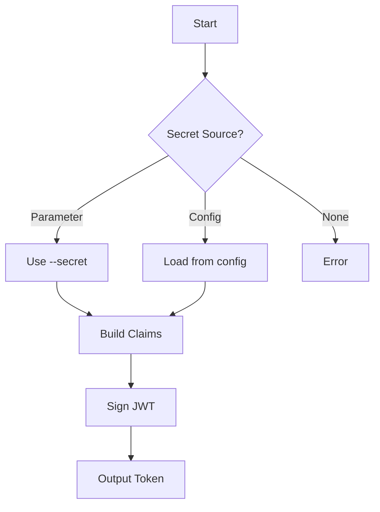
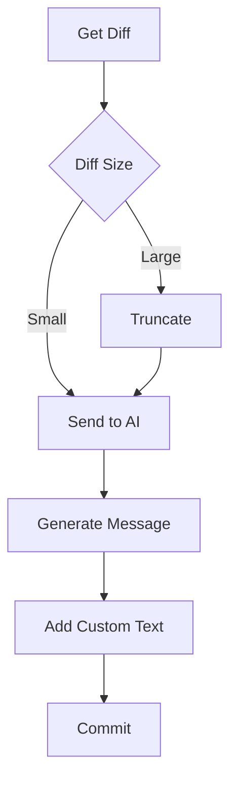
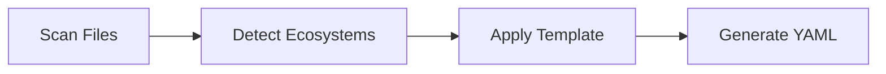
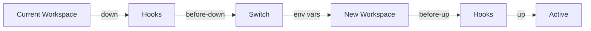

# `jig` - A CLI Toolbox

[](https://deepwiki.com/daveio/jig)

## Overview

`jig` is a comprehensive CLI toolbox that consolidates various utilities into a single, unified command-line interface. Built with Rust, it provides a consistent experience for common development, security, and administrative tasks.

## Installation

### Standalone Installation

`jig` can be installed as a standalone binary.

### Shell Plugin Installation

Alternatively, install as a shell plugin using your preferred package manager:

**Fish Shell:**

- `fisher`
- `oh-my-fish`
- `fundle`
- `fisherman`

**Zsh:**

- `antigen`
- `antidote`
- `antibody`
- `zplug`
- `zplugin`
- `oh-my-zsh`

**Bash:**

- `bash-it`
- `oh-my-bash`

### Shell Plugin Features

- Automatic directory creation and management
- Seamless `jig workspace hook` integration
- Automatic `$PATH` / `$fish_user_paths` configuration
- Maintains supporting artifacts in `~/.local/share/jig`
- Shell completion support (via `clap`)

## Quick Start

```bash
# Install jig
cargo install jig

# Initialize configuration
jig init

# View help
jig --help
```

## Command Structure

```mermaid
---
config:
  layout: elk
  theme: dark
---
graph LR
  jig[jig]
    jig --> init(init)
    jig --> crypto(crypto)
      crypto --> cryptoEncrypt(encrypt)
      crypto --> cryptoDecrypt(decrypt)
      crypto --> cryptoPublic(public)
    jig --> generate(generate)
      generate --> generateHex(hex)
      generate --> generatePassword(password)
      generate --> generateKey(key)
      generateKey --> generateKeyCrypto(crypto)
      generateKey --> generateKeyWireguard(wireguard)
      generate --> generateJwt(jwt)
    jig --> network(network)
      network --> networkDns(dns)
        networkDns --> networkDnsFlush(flush)
        networkDns --> networkDnsLookup(lookup)
        networkDns --> networkDnsSec(sec)
    jig --> domain(domain)
      domain --> domainCheck(check)
      domain --> domainExpiry(expiry)
      domain --> domainNs(ns)
    jig --> tls(tls)
      tls --> tlsCert(cert)
      tls --> tlsCiphers(ciphers)
    jig --> api(api)
      api --> apiTicket(ticket)
        apiTicket --> apiTicketTitle(title)
        apiTicket --> apiTicketDescription(description)
        apiTicket --> apiTicketEnrich(enrich)
      api --> apiImage(image)
        apiImage --> apiImageAlt(alt)
        apiImage --> apiImageOptimise(optimise)
      api --> apiToken(token)
        apiToken --> apiTokenInfo(info)
        apiToken --> apiTokenRevoke(revoke)
        apiToken --> apiTokenUsage(usage)
      api --> apiPing(ping)
    jig --> mcp(mcp)
    jig --> dance(dance)
    jig --> terminal(terminal)
      terminal --> terminalSysinfo(sysinfo)
      terminal --> terminalXKCD(xkcd)
    jig --> project(project)
      project --> projectNew(new)
      project --> projectUpdate(update)
      project --> projectBump(bump)
      project --> projectDependabot(dependabot)
      project --> projectTemplate(template)
        projectTemplate --> projectTemplateList(list)
        projectTemplate --> projectTemplateNew(new)
        projectTemplate --> projectTemplateUpdate(update)
    jig --> git(git)
      git --> gitClone(clone)
      git --> gitBinary(binary)
        gitBinary --> gitBinaryGet(get)
        gitBinary --> gitBinaryUpdate(update)
        gitBinary --> gitBinaryShow(show)
        gitBinary --> gitBinaryRemove(remove)
      git --> gitSecrets(secrets)
      git --> gitCommit(commit)
      git --> gitYank(yank)
      git --> gitLatest(latest)
    jig --> workspace(workspace)
      workspace --> workspaceSwitch(switch)
      workspace --> workspaceList(list)
      workspace --> workspaceHook(hook)
    jig --> ai(ai)
      ai --> aiRename(rename)
        aiRename --> aiRenameImage(image)

  style dance stroke-dasharray: 2 3,stroke-width: 5px
```



## Configuration

`jig` uses YAML configuration files for customization. The configuration system is built with `saphyr` and `serde` for robust YAML operations.

### Configuration File Location

- Primary: `~/.jig.yaml`
- Secrets (optional): `~/.jig.secrets`

### Minimal Configuration

The bare minimum configuration requires only an encryption key:

```yaml
secret:
  key: AGE-SECRET-KEY-[...]
```

### Complete Configuration Reference

```yaml
dns:
  nameserver: 8.8.8.8
generate:
  password:
    emoji: true
git:
  commit:
    after: null
    before: null
    prefixes:
      - docs
      - feat
      - fix
      - perf
      - refactor
      - style
      - test
  internal: true
  user: daveio
project:
  dependabot:
    schedule:
      interval: daily
    open-pull-requests-limit: 100
    assignees:
      - daveio
    groups:
      all-dependencies:
        patterns:
          - "*"
secret:
  file: ~/.jig.secrets # ignores all other secret configuration if set, even if the file doesn't exist
  api:
    domainr:
      env: DOMAINR_API_KEY
      key:
  main:
    env: JIG_SECRET_KEY
    file: ~/.jig.secret.key
    key: AGE-SECRET-KEY-[...]
    order:
      - env
      - file
      - key
  jwt:
    env: JIG_JWT_SECRET
    file: ~/.jig.jwt.key
    key: JWT_SECRET_VALUE
    order:
      - env
      - file
      - key
template:
  branch: template
  repository: daveio/jig
workspace:
  current: example
  create: false
  hooks:
    before-up: []
    after-up:
      - echo "hello example"
    before-down: []
    after-down:
      - echo "bye example"
  workspaces:
    example:
      up:
        - gcloud config configurations activate example
        - gcloud config set project example_project
        - kubectx example_cluster
      down: []
      env:
        EXAMPLE_VAR: abc123
        ANOTHER_VAR: "true"
        YET_ANOTHER_VAR: "12345"
yank:
  dir: ~/src
  fetch: --prune --tags --prune-tags --recurse-submodules=yes
  pull: --all --tags --prune --jobs=8 --recurse-submodules=yes
```

### Minimal Configuration Example

For a quick start, use this minimal configuration:

```yaml
secret:
  key: AGE-SECRET-KEY-[...]
```

## Global Command Options

All `jig` commands support these universal options:

| Option      | Short | Description                                                |
| ----------- | ----- | ---------------------------------------------------------- |
| `--version` | `-V`  | Display version information                                |
| `--help`    | `-h`  | Show help for a command                                    |
| `--yes`     | `-y`  | Skip all confirmations                                     |
| `--json`    | `-j`  | Output structured JSON (formatted with `stringify_pretty`) |
| `--verbose` | `-v`  | Detailed output to STDERR (incompatible with `--json`)     |
| `--quiet`   | `-q`  | Minimal output to STDERR (incompatible with `--json`)      |
| `--silent`  | `-s`  | No output to STDOUT/STDERR (incompatible with `--json`)    |

> **Note:** Commands support abbreviation to the point of disambiguation via `clap`.

## Command Reference

### `jig init`

Initialize jig configuration and set up the environment.

**Summary:** Creates necessary directories, fetches templates, generates configuration with encryption keys, and sets up shell integration.

**Parameters:**

- `-c`, `--clobber`: Overwrite existing configuration without confirmation

**Configuration:** None.

**Flow:**

1. Create required directories:
   - `~/.local/share/jig`
   - `~/.local/share/jig/bin`
   - `~/.local/share/jig/templates`
2. Clone template repository from GitHub
3. Generate new encryption key if creating config
4. Create configuration file (prompts if exists unless `--clobber`)
5. Check shell integration status
6. Provide setup instructions if integration inactive

**Notes:**

- Uses `git` CLI or `gix` based on `git.internal` config
- Templates default to `templates` branch of `jig` repository
- Can be customized via `template.repository` and `template.branch`

### `jig ai`

AI-powered utilities for various automation tasks.

#### `jig ai rename`

AI-powered renaming operations.

##### `jig ai rename image`

Automatically rename image files using AI-generated descriptive names.

**Summary:** Analyzes image content and generates descriptive filenames following a standardized format.

**Parameters:**

- `[FILENAME_OR_GLOB]`: File or glob pattern to rename (defaults to all `*.jpg`, `*.jpeg`, `*.png`, `*.webp` in current directory)
- Multiple filenames/globs can be specified

**Configuration:** None.

**Flow:**

1. Process each image file through `prepare_image_for_claude` utility
2. Send image to Claude for content analysis
3. Generate filename using format: `descriptive_words-YYYYMMDD-HHMMss.ext`
4. Rename file with generated name
5. Clean up temporary files

**Notes:** Uses internal `ask_claude` utility for AI processing.

### `jig api`

Interact with the dave.io API services.

**Base URL:** `https://dave.io/`

#### `jig api ping`

Check API health and connectivity.

**Summary:** Performs a simple health check against the API endpoint.

**Parameters:** None.

**Configuration:** None.

**Flow:**

1. Send GET request to `/api/ping`
2. Display JSON response data

#### `jig api image`

Image processing and AI operations.

##### `jig api image alt`

Generate AI-powered alt text for accessibility.

**Summary:** Analyzes images and generates descriptive alt text for web accessibility.

**Parameters:**

- `[FILENAME]`: Image file to process

**Configuration:** None.

**Flow:**

1. Process image through `prepare_image_for_claude` utility
2. Send processed image to `/api/ai/alt` via POST
3. Return generated alt text

##### `jig api image optimise`

Optimize images for web delivery.

**Summary:** Reduces image file size while maintaining quality.

**Parameters:**

- `[FILENAME]`: Image file to optimize

**Configuration:** None.

**Flow:**

1. Send image to `/api/images/optimise` via POST
2. Receive and save optimized image

#### `jig api ticket`

AI-powered ticket management utilities.

##### `jig api ticket title`

Generate concise ticket titles from descriptions.

**Summary:** Creates well-formatted ticket titles from detailed descriptions.

**Parameters:**

- `[DESCRIPTION]`: Ticket description text (required)
- `-i`, `--input`: Read description from file
- `-S`, `--stdin`: Read description from stdin

**Configuration:** None.

**Flow:**

1. Send description to `/api/tickets/title`
2. Return generated title

##### `jig api ticket description`

Generate detailed descriptions from titles.

**Summary:** Expands ticket titles into comprehensive descriptions.

**Parameters:**

- `[TITLE]`: Ticket title text (required)
- `-i`, `--input`: Read title from file
- `-S`, `--stdin`: Read title from stdin

**Configuration:** None.

**Flow:**

1. Send title to `/api/tickets/description`
2. Return generated description

##### `jig api ticket enrich`

Enhance ticket information with additional context.

**Summary:** Adds metadata and context to existing tickets.

**Parameters:** None.

**Configuration:** None.

**Flow:** None.

#### `jig api token`

API token management operations.

##### `jig api token info`

Retrieve token details and metadata.

**Summary:** Displays information about a specific API token.

**Parameters:**

- `[UUID]`: Token UUID (required)

**Configuration:** None.

**Flow:**

1. Send GET request to `/api/tokens/$UUID`
2. Display token information

##### `jig api token revoke`

Revoke an active API token.

**Summary:** Permanently invalidates a token.

**Parameters:**

- `[UUID]`: Token UUID to revoke (required)

**Configuration:** None.

**Flow:**

1. Send POST request to `/api/tokens/$UUID/revoke`
2. Confirm revocation

##### `jig api token usage`

View token usage statistics.

**Summary:** Shows usage metrics and limits for a token.

**Parameters:**

- `[UUID]`: Token UUID (required)

**Configuration:** None.

**Flow:**

1. Send GET request to `/api/tokens/$UUID/usage`
2. Display usage statistics

### `jig crypto`

Encryption and decryption operations using age encryption.

#### `jig crypto encrypt`

Encrypt data using age encryption.

**Summary:** Encrypts files or stdin data using the age encryption standard.

**Parameters:**

- `-i`, `--input`: Input file to encrypt (reads stdin if omitted)
- `-o`, `--output`: Output file for ciphertext (writes to stdout if omitted)
- `-k`, `--key [KEY]`: Override default encryption key

**Configuration:**

- `secret.main.key`: Default encryption key
- `secret.main.env`: Environment variable for key
- `secret.main.file`: File containing key

**Flow:**

1. Read input data from file or stdin
2. Load encryption key (parameter > env > file > config)
3. Encrypt using age encryption
4. Write ciphertext to file or stdout

**Notes:** Supports binary input. Information messages sent to stderr.

#### `jig crypto decrypt`

Decrypt age-encrypted data.

**Summary:** Decrypts files or stdin data encrypted with age.

**Parameters:**

- `-i`, `--input`: Input file to decrypt (reads stdin if omitted)
- `-o`, `--output`: Output file for plaintext (writes to stdout if omitted)
- `-k`, `--key [KEY]`: Override default decryption key

**Configuration:**

- `secret.main.key`: Default decryption key
- `secret.main.env`: Environment variable for key
- `secret.main.file`: File containing key

**Flow:**

1. Read ciphertext from file or stdin
2. Load decryption key (parameter > env > file > config)
3. Decrypt using age
4. Write plaintext to file or stdout

**Notes:** Supports binary output. Information messages sent to stderr.

#### `jig crypto public`

Display public key for encryption.

**Summary:** Shows the public key (recipient) associated with a private key.

**Parameters:**

- `-k`, `--key [KEY]`: Private key to process (uses configured key if omitted)

**Configuration:**

- `secret.main.key`: Default private key

**Flow:**

1. Load private key
2. Derive and display public recipient key

**Notes:** Public key is used as recipient in age encryption.

### `jig dance`

Easter egg command with animated terminal effects.

**Summary:** Hidden command that displays animated terminal effects and ASCII art.

**Parameters:** None.

**Configuration:** None.

**Flow:**

1. Initialize terminal effects engine
2. Display animated sequences
3. Clean up and restore terminal

**Notes:**

- Not shown in `--help` output
- Not exposed via MCP
- See "Easter Egg Nonsense" section for implementation details

### `jig domain`

Domain management and information tools.

#### `jig domain check`

Check domain name availability across TLDs.

**Summary:** Searches for available domain names using the Domainr API, filtered to Cloudflare-supported TLDs.

**Parameters:**

- `[QUERY]`: Domain name to check (required)
- `-d`, `--domaincheck`: Use external `domaincheck` tool instead

**Configuration:**

- `api.domainr`: Domainr API key

**Flow:**

1. Query Domainr API with search term
2. Filter results to Cloudflare TLD list
3. Display availability status for each TLD

**Notes:**

- Requires Domainr API key in configuration
- Limited to Cloudflare-supported TLDs:
  `ac` `academy` `accountant` `accountants` `actor` `adult` `agency` `ai` `airforce` `apartments` `app` `army` `associates` `attorney` `auction` `audio` `baby` `band` `bar` `bargains` `beer` `bet` `bid` `bike` `bingo` `biz` `black` `blog` `blue` `boo` `boston` `boutique` `broker` `build` `builders` `business` `cab` `cafe` `cam` `camera` `camp` `capital` `cards` `care` `careers` `casa` `cash` `casino` `catering` `cc` `center` `ceo` `chat` `cheap` `christmas` `church` `city` `claims` `cleaning` `clinic` `clothing` `cloud` `club` `co` `co.uk` `coach` `codes` `coffee` `college` `com` `com.ai` `com.co` `community` `company` `compare` `computer` `condos` `construction` `consulting` `contact` `contractors` `cooking` `cool` `coupons` `credit` `creditcard` `cricket` `cruises` `dad` `dance` `date` `dating` `day` `dealer` `deals` `degree` `delivery` `democrat` `dental` `dentist` `design` `dev` `diamonds` `diet` `digital` `direct` `directory` `discount` `doctor` `dog` `domains` `download` `education` `email` `energy` `engineer` `engineering` `enterprises` `equipment` `esq` `estate` `events` `exchange` `expert` `exposed` `express` `fail` `faith` `family` `fan` `fans` `farm` `fashion` `feedback` `finance` `financial` `fish` `fishing` `fit` `fitness` `flights` `florist` `flowers` `fm` `foo` `football` `forex` `forsale` `forum` `foundation` `fun` `fund` `furniture` `futbol` `fyi` `gallery` `game` `games` `garden` `gifts` `gives` `glass` `global` `gmbh` `gold` `golf` `graphics` `gratis` `green` `gripe` `group` `guide` `guitars` `guru` `haus` `health` `healthcare` `help` `hockey` `holdings` `holiday` `horse` `hospital` `host` `hosting` `house` `how` `icu` `immo` `immobilien` `inc` `industries` `info` `ink` `institute` `insure` `international` `investments` `io` `irish` `jetzt` `jewelry` `kaufen` `kim` `kitchen` `land` `lawyer` `lease` `legal` `lgbt` `life` `lighting` `limited` `limo` `link` `live` `loan` `loans` `lol` `love` `ltd` `luxe` `maison` `management` `market` `marketing` `markets` `mba` `me` `me.uk` `media` `memorial` `men` `miami` `mobi` `moda` `mom` `money` `monster` `mortgage` `mov` `movie` `navy` `net` `net.ai` `net.co` `net.uk` `network` `new` `news` `nexus` `ngo` `ninja` `nom.co` `observer` `off.ai` `ong` `online` `org` `org.ai` `org.uk` `organic` `page` `partners` `parts` `party` `pet` `phd` `photography` `photos` `pics` `pictures` `pink` `pizza` `place` `plumbing` `plus` `porn` `press` `pro` `productions` `prof` `promo` `properties` `protection` `pub` `racing` `realty` `recipes` `red` `rehab` `reise` `reisen` `rent` `rentals` `repair` `report` `republican` `rest` `restaurant` `review` `reviews` `rip` `rocks` `rodeo` `rsvp` `run` `sale` `salon` `sarl` `school` `schule` `science` `security` `select` `services` `sex` `sh` `shoes` `shop` `shopping` `show` `singles` `site` `ski` `soccer` `social` `software` `solar` `solutions` `soy` `space` `storage` `store` `stream` `studio` `style` `supplies` `supply` `support` `surf` `surgery` `systems` `tax` `taxi` `team` `tech` `technology` `tennis` `theater` `theatre` `tienda` `tips` `tires` `today` `tools` `tours` `town` `toys` `trade` `trading` `training` `travel` `tv` `uk` `university` `uno` `us` `vacations` `ventures` `vet` `viajes` `video` `villas` `vin` `vip` `vision` `vodka` `voyage` `watch` `webcam` `website` `wedding` `wiki` `win` `wine` `work` `works` `world` `wtf` `xxx` `xyz` `yoga` `zone`

#### `jig domain expiry`

Check domain expiration dates.

**Summary:** Retrieves domain registration expiry information via RDAP.

**Parameters:**

- `[DOMAIN]`: Domain name to check (required)

**Configuration:** None.

**Flow:**

1. Query RDAP server for domain info
2. Extract expiration date from response
3. Display days until expiry
4. If RDAP fails, provide WHOIS lookup URL

**Notes:** Uses `rdap-icann-client` for RDAP queries.

#### `jig domain ns`

Retrieve nameserver information.

**Summary:** Displays authoritative nameservers for a domain.

**Parameters:**

- `[DOMAIN]`: Domain name to check (required)

**Configuration:** None.

**Flow:**

1. Query RDAP for nameserver data
2. If RDAP fails, perform DNS NS record lookup
3. Display nameserver list

**Notes:** Falls back to DNS lookup if RDAP unavailable.

### `jig generate`

Cryptographically secure generation utilities.

**Global Options for Deterministic Generation:**

- `-k`, `--keyed [name]`: Generate deterministic output using encryption key + name
- `-d`, `--seed [value]`: Use custom seed instead of encryption key (processed with argon2)

#### `jig generate hex`

Generate random hexadecimal strings.

**Summary:** Creates cryptographically secure random hex values for IDs, tokens, or secrets.

**Parameters:**

- `[LENGTH]`: Number of bytes (default: 16 bytes = 32 hex chars)

**Configuration:** None.

**Flow:**

1. Generate random bytes
2. Convert to hexadecimal string
3. Output lowercase hex

#### `jig generate password`

Generate secure passwords with customizable complexity.

**Summary:** Creates strong passwords with entropy validation and character set requirements.

**Parameters:**

- `[LENGTH]`: Password length (default: 16, or word count in xkcd mode)
- `-e`, `--emoji`: Include emoji characters
- `-x`, `--xkcd`: Generate passphrase using word list

**Configuration:**

- `generate.password.emoji`: Enable emoji by default

**Flow:**

1. Select character sets based on options
2. Generate password ensuring one char from each set
3. Check entropy with `zxcvbn` (minimum score: 3)
4. Regenerate if entropy too low
5. Display password with security metrics

**Notes:**

- Base alphabet: `A-Z`, `a-z`, `0-9`, `@%^-_,.~`
- Emoji alphabet: 😀😃😄😁😆😅😂🤣😊😇🙂🙃😉😌😍🥰😘😗😙😚😋😛😜🤪😝🤑🤗🤭🤫🤔🤐🤨😐😑😶😏😒🙄😬🤥😌😔😪🤤😴😷🤒🤕🤢🤮🤧🥵🥶🥴😵🤯🤠🥳😎🤓🧐😕😟🙁☹️😮😯😲😳🥺😦😧😨😰😥😢😭😱😖😣😞😓😩😫🥱😤😡😠🤬😈👿💀☠️💩🤡👹👺👻

#### `jig generate key`

Generate various types of cryptographic keys.

##### `jig generate key crypto`

Generate age encryption keys.

**Summary:** Creates private keys for age-based encryption.

**Parameters:**

- `-w`, `--write`: Save key to configuration file

**Configuration:**

- `secret.main.key`: Where to store the key

**Flow:**

1. Generate age private key
2. Display private and public keys
3. Optionally save to config

##### `jig generate key wireguard`

Generate WireGuard VPN keys.

**Summary:** Creates WireGuard private and public key pairs.

**Parameters:** None.

**Configuration:** None.

**Flow:**

1. Generate WireGuard private key
2. Derive public key
3. Display both keys

#### `jig generate jwt`

Generate JSON Web Tokens with claims.

**Summary:** Creates signed JWTs for API authentication.

**Parameters:**

- `--subject [subject]`: Token subject (required, e.g., "ai:alt")
- `--description [text]`: Human-readable description
- `--expiry [duration]`: Expiration time (default: "1h")
- `--claim [key=value]`: Custom claims (repeatable)
- `--secret [secret]`: Signing secret
- `--algorithm [alg]`: Algorithm (default: HS256)

**Configuration:**

- `secret.jwt.key`: Default JWT secret
- `secret.jwt.env`: Environment variable for secret
- `secret.jwt.file`: File containing secret

**Flow:**

1. Generate UUID for token ID
2. Build claims with subject and custom data
3. Load signing secret (parameter > config > error)
4. Sign token with specified algorithm
5. Output JWT



### `jig git`

Git and GitHub utilities for repository and release management.

#### `jig git binary`

Manage binary releases from GitHub repositories.

**Storage:** `~/.local/share/jig/binaries.yaml` (metadata), `~/.local/share/jig/bin` (binaries)

##### `jig git binary get`

Install binary releases from GitHub.

**Summary:** Downloads and installs the latest binary release for your platform.

**Aliases:** `install`, `add`

**Parameters:**

- `[USERNAME]/[REPO]`: GitHub repository (required)

**Configuration:** None.

**Flow:**

1. Query GitHub API for latest release
2. Find binary matching current OS/architecture
3. Download to `~/.local/share/jig/bin`
4. Make executable
5. Save metadata with hash to `binaries.yaml`
6. Display installation path

**Notes:** PATH integration handled by shell hook.

##### `jig git binary show`

Display information about installed binaries.

**Summary:** Shows installation path and optional hash information.

**Parameters:**

- `[USERNAME]/[REPO]`: GitHub repository
- `-H`, `--hashes`: Include file hashes

**Configuration:** None.

**Flow:**

1. Read metadata from `binaries.yaml`
2. Display path and optional hash

##### `jig git binary update`

Update installed binaries to latest versions.

**Summary:** Checks for and installs newer releases.

**Parameters:**

- `[USERNAME]/[REPO]`: Specific repository to update
- `[BINARY_NAME]`: Update by binary name
- `-a`, `--all`: Update all installed binaries

**Configuration:** None.

**Flow:**

1. Check current version hash
2. Query GitHub for latest release
3. Compare hashes to detect changes
4. Download and replace if newer
5. Update metadata

##### `jig git binary remove`

Remove installed binaries.

**Summary:** Uninstalls binaries and cleans up metadata.

**Aliases:** `rm`

**Parameters:**

- `[USERNAME]/[REPO]`: Repository to remove
- `[BINARY_NAME]`: Remove by binary name

**Configuration:** None.

**Flow:**

1. Remove binary from filesystem
2. Clean up metadata entry
3. Confirm removal

#### `jig git clone`

Clone GitHub repositories with simplified syntax.

**Summary:** Clone repositories using short `username/repo` or just `repo` notation.

**Parameters:**

- `[USERNAME]/[REPO]` or `[REPO]`: Repository to clone
- `-c`, `--cli`: Use git CLI instead of gix
- `-i`, `--internal`: Force use of gix library

**Configuration:**

- `git.internal`: Use gix library by default (true)
- `git.user`: Default GitHub username

**Flow:**

1. Resolve full repository path
2. If just `repo`, use configured username
3. Clone using gix or git CLI
4. Set up local repository

**Notes:**

- SSH agent support may require `--cli` flag
- Defaults to gix for better performance

#### `jig git commit`

Generate AI-powered commit messages.

**Summary:** Creates conventional commit messages with AI analysis of changes.

**Parameters:**

- `[PARAMETERS]`: Additional git commit parameters

**Configuration:**

- `git.commit.prefixes`: Allowed conventional prefixes
- `git.commit.before`: Prepend text to messages
- `git.commit.after`: Append text to messages

**Flow:**

1. Generate diff of staged changes
2. Truncate large diffs for AI processing
3. Send to Claude with commit format instructions
4. Generate emoji + conventional prefix title
5. Add configured before/after text
6. Execute commit with generated message



**Notes:** Reimplements `oco` functionality natively.

#### `jig git latest`

Get latest commit hash from GitHub.

**Summary:** Retrieves the most recent commit SHA for a branch.

**Parameters:**

- `[USERNAME]/[REPO]`: Repository to query
- `[BRANCH]`: Branch name (defaults to default branch)

**Configuration:** None.

**Flow:**

1. Query GitHub API for branch info
2. Extract latest commit SHA
3. Display hash

#### `jig git secret`

Manage GitHub repository secrets.

**Summary:** Set encrypted secrets for GitHub Actions.

**Parameters:**

- `[USERNAME]/[REPO]` or `[REPO]`: Target repository
- `[SECRET_NAME]`: Secret name
- `[SECRET_VALUE]`: Secret value (or stdin)

**Configuration:**

- `git.user`: Default GitHub username

**Flow:**

1. Resolve repository path
2. Read value from parameter or stdin
3. Encrypt and upload to GitHub
4. Confirm secret creation

#### `jig git yank`

Batch update all Git repositories.

**Summary:** Recursively fetch and pull all repositories in a directory.

**Parameters:**

- `[DIRECTORY]`: Root directory to search
- `-c`, `--cli`: Use git CLI
- `-i`, `--internal`: Force gix usage

**Configuration:**

- `yank.dir`: Default directory
- `yank.fetch`: Git fetch parameters
- `yank.pull`: Git pull parameters
- `git.internal`: Use gix by default

**Flow:**

1. Find all `.git` directories recursively
2. For each repository:
   - Run fetch with configured parameters
   - Run pull with configured parameters
3. Report success/failure summary

**Notes:**

- Respects fetch/pull parameters when possible
- SSH operations may require `--cli`

### `jig mcp`

Model Context Protocol server for AI agent integration.

**Summary:** Provides a stdio MCP server allowing AI agents to interact with jig functionality.

**Parameters:** None.

**Configuration:** None.

**Flow:** None.

**Notes:**

- Implementation planned post-initial release
- Future plans for WASM compilation and remote MCP
- Will expose dave.io API endpoints via MCP

### `jig network`

Network utilities and diagnostics.

#### `jig network dns`

DNS query and management tools.

##### `jig network dns flush`

Clear local DNS cache.

**Summary:** Flushes DNS resolver cache on the local system.

**Parameters:** None.

**Configuration:** None.

**Flow:**

1. Detect operating system
2. Execute appropriate flush command:
   - macOS: `dscacheutil -flushcache`
   - Linux: `systemd-resolve --flush-caches`
   - Windows: `ipconfig /flushdns`

##### `jig network dns lookup`

Perform DNS queries.

**Summary:** Query DNS records with optional custom resolvers.

**Parameters:**

- `[QUERY]`: Domain name to query
- `[TYPE]`: Record type (A, AAAA, MX, TXT, etc.)
- `--root`: Use root nameservers
- `--server [SERVER]`: Use specific nameserver

**Configuration:**

- `dns.nameserver`: Default resolver

**Flow:**

1. Select resolver (system/root/custom)
2. Perform DNS query
3. Display formatted results

**Notes:** `--root` and `--server` are mutually exclusive.

##### `jig network dns sec`

Verify DNSSEC configuration.

**Summary:** Checks DNSSEC validation chain for a domain.

**Parameters:**

- `[DOMAIN]`: Domain to verify

**Configuration:** None.

**Flow:**

1. Query DNSKEY records
2. Verify DS records at parent
3. Validate signature chain
4. Report validation status

### `jig project`

Project management and scaffolding utilities.

#### `jig project bump`

Update all dependencies to latest versions.

**Summary:** Automatically updates package versions across multiple package managers.

**Parameters:** None.

**Configuration:** None.

**Flow:**

1. Scan for package files:
   - `Cargo.toml`
   - `package.json`
   - `.github/workflows/*.ya?ml`
2. For each dependency:
   - Fetch latest version
   - Update version specification
3. For GitHub Actions:
   - Pin to latest commit SHA

**Notes:**

> **⚠️ CAUTION:** Updates to latest major versions may introduce breaking changes.
> GitHub Actions are pinned to default branch commits.

#### `jig project dependabot`

Generate Dependabot configuration.

**Summary:** Creates `.github/dependabot.yml` based on detected package managers.

**Parameters:** None.

**Configuration:**

- `project.dependabot`: Template for dependabot config

**Flow:**

1. Scan project for package files
2. Identify ecosystems (npm, cargo, pip, etc.)
3. Generate config with:
   - Ecosystem type
   - Directory location
   - Update schedule
   - Configured options



#### `jig project new`

Create new project from template.

**Summary:** Scaffolds a new project using Tera templates.

**Parameters:**

- `[TEMPLATE]`: Template name to use
- `[NAME]`: Project name/directory
- `-n`, `--name`: Override project name
- `-g`, `--git`: Initialize git repo
- `-G`, `--no-git`: Skip git initialization

**Configuration:**

- `git.internal`: Default git backend

**Flow:**

1. Create project directory
2. Load template from `~/.local/share/jig/templates` and `~/.local/share/jig/templates/_shared`
3. Process Tera templates with context
4. Write files with git commits (if enabled)
5. Create `.jig.yaml` tracking file

**Notes:** Templates support Tera syntax for dynamic content.

**Notes:**

- Creates `.jig.yaml` tracking file with:
  - Template repository
  - Branch name
  - Template path
  - Applied commit
  - Creation/update timestamps

#### `jig project update`

Update existing project with template changes.

**Summary:** Applies template updates while preserving local modifications.

**Parameters:**

- `-c`, `--clobber`: Force overwrite without merge
- `-n`, `--name`: Override project name

**Configuration:** None.

**Flow:**

1. Read `.jig.yaml` for template info
2. Fetch latest template version
3. Compare with applied version
4. For each changed file:
   - Show diff
   - Prompt for action (unless `--clobber`)
5. Update `.jig.yaml` metadata

#### `jig project template`

Manage project templates.

**`.jig.template.yaml`:**

The `.jig.template.yaml` file is in the root of each template and defines its behaviour.

```yaml
name: null # if omitted or null, name of the root directory of the template, default: null
shared: true # if false, disable shared template when rendering this template, default: true
```

##### `jig project template list`

List available templates.

**Summary:** Shows all installed project templates.

**Parameters:** None.

**Configuration:** None.

**Flow:**

1. Scan template directory
2. Display template names and descriptions

##### `jig project template new`

Create a new template.

**Summary:** Initialize a new project template.

**Parameters:**

- `-S`, `--shared`: Copy files from `_shared` and disable the shared template for this template
- `[NAME]`: Template name (required)

**Configuration:** None.

**Flow:**

1. Check if template exists
2. Create template directory
3. Set up `.jig.template.yaml` with metadata and shared template behaviour
4. Add base files from `_shared` if required

##### `jig project template update`

Update template repository.

**Summary:** Fetches latest templates from configured repository.

**Parameters:**

- `-c`, `--cli`: Use git CLI
- `-i`, `--internal`: Force gix usage

**Configuration:**

- `git.internal`: Default git backend
- `template.repository`: Template source
- `template.branch`: Template branch

**Flow:**

1. Pull latest from template repository
2. Update local template cache

### `jig terminal`

Terminal utilities and visual enhancements.

#### `jig terminal sysinfo`

Display system information visually.

**Summary:** Shows system metrics as graphical gauges in the terminal.

**Parameters:** None.

**Configuration:** None.

**Flow:**

1. Gather system metrics (CPU, memory, disk)
2. Generate gauge visualization (SVG/raster)
3. Detect terminal capabilities
4. Resize image for terminal dimensions
5. Display using appropriate protocol (sixel, kitty, iTerm2)

**Notes:** Uses `viuer` for terminal detection and display.

#### `jig terminal xkcd`

Display XKCD comics in terminal.

**Summary:** Fetches and displays XKCD comics with terminal-appropriate rendering.

**Parameters:**

- `[NUMBER]`: Specific comic number (latest if omitted)

**Configuration:** None.

**Flow:**

1. Fetch comic metadata from XKCD API
2. Download comic image
3. Resize for terminal display
4. Render using terminal graphics protocol

### `jig tls`

TLS/SSL certificate and security utilities.

#### `jig tls cert`

Retrieve TLS certificates.

**Summary:** Fetches and displays TLS certificates from remote hosts.

**Parameters:**

- `[HOSTNAME]`: Target host (required)
- `[PORT]`: Target port (default: 443)
- `-c`, `--chain`: Include full certificate chain

**Configuration:** None.

**Flow:**

1. Establish TLS connection
2. Retrieve certificate(s)
3. Output in PEM format to stdout

#### `jig tls ciphers`

List supported cipher suites.

**Summary:** Shows enabled TLS cipher suites for a host.

**Parameters:**

- `[HOSTNAME]`: Target host (required)
- `[PORT]`: Target port (default: 443)

**Configuration:** None.

**Flow:**

1. Connect with various cipher suites
2. Record successful handshakes
3. Display supported ciphers with strength ratings

### `jig workspace`

Workspace environment management.

**Summary:** Manage multiple work environments with different configurations.

**Alias:** `ws`

#### `jig workspace list`

List configured workspaces.

**Summary:** Shows all available workspace configurations.

**Parameters:** None.

**Configuration:**

- `workspace.workspaces`: Workspace definitions

**Flow:**

1. Read workspace configurations
2. Display names and current indicator

#### `jig workspace switch`

Switch active workspace.

**Summary:** Changes environment variables and runs transition commands.

**Parameters:**

- `[WORKSPACE]`: Target workspace name (required)

**Configuration:**

- `workspace.current`: Current workspace
- `workspace.create`: Auto-create if missing
- `workspace.workspaces.[name]`: Workspace definitions

**Flow:**

1. Run current workspace `down` commands
2. Execute global `before-down` hooks
3. Update environment variables
4. Execute global `before-up` hooks
5. Run new workspace `up` commands
6. Execute global `after-up` hooks



#### `jig workspace hook`

Shell integration hook.

**Summary:** Internal command for shell prompt integration.

**Parameters:**

- `[SHELL]`: Shell type (bash, zsh, fish)

**Configuration:** None.

**Flow:**

1. Export workspace environment variables
2. Update PATH if needed
3. Display workspace indicator

**Notes:** Called automatically by shell integration.

## Technical Implementation

### Shared Utilities

#### `prepare_image_for_claude`

Optimizes images for Claude API compatibility.

**Process:**

1. Resize images over 2048px on long edge
2. Convert to WebP format
3. Apply compression levels (lossless → 90% → 75% → 50% → 25%)
4. Ensure final size under 5MB

#### `ask_claude`

Sends prompts with optional data/images to Claude.

**Parameters:**

- `PROMPT`: Main prompt text
- `ASSOCIATED_DATA`: Additional context (optional)
- `IMAGE`/`FILENAME`: Image data (optional)

#### `resolve_github_username`

Determines current GitHub username.

**Priority:**

1. `git.user` configuration
2. `gh api user --jq .login` command
3. Error if unavailable

### Git Abstraction

Unified interface supporting both `git` CLI and `gix` library based on configuration.

### Library Dependencies

- **YAML Processing:** `saphyr` with `serde`
- **Spinner Effects:** `spinoff` (noise/aesthetic modes)
- **Hashing:** `blake3` (native), `sha2` (verification)
- **Model Context Protocol:** `rmcp`
- **Additional formats:** See [serde.rs](https://serde.rs/#data-formats)

## Vendoring

Vendoring is disabled by default. To enable, create `.cargo/config.toml`:

```toml
[source.crates-io]
replace-with = "vendored-sources"

[source.vendored-sources]
directory = "vendor"
```

## Easter Egg Implementation

The `jig dance` command uses advanced terminal effects:

### Effects Libraries

- **`tachyonfx`**: Primary shader-like effects engine for ratatui
- **`tui-rain`**: Matrix rain and atmospheric effects
- **`firework-rs`**: ASCII firework animations
- **`rascii_art`**: Image to ASCII/emoji conversion
- **`rusty-termcolor`**: Typewriter and text effects
- **`spinoff`**: Loading spinners and indicators

### Implementation Details

- **ASCII Art:** Advanced image conversion with color and emoji support
- **Atmospheric:** Rain, snow, and Matrix effects
- **Core Engine:** Complex shader-like terminal transformations
- **Explosions:** Particle-based firework simulations
- **Progress:** 80+ spinner variants with custom colors
- **Text Effects:** Typewriter, wiggle, and Matrix text animations
