# `jig` - A CLI Toolbox

[](https://deepwiki.com/daveio/jig)

## Project

`jig` is a utility which collects tools for various tasks into one place. It merges all my disparate tools into a single CLI toolbox, making it easier to manage and use them, and teaches me Rust.

## Command Tree

```mermaid
---
config:
  theme: dark
  layout: elk
---
graph LR
  jig[jig] --> init(init)
  jig --> crypto(crypto)
    crypto --> cryptoEncrypt(encrypt)
    crypto --> cryptoDecrypt(decrypt)
    crypto --> cryptoPublic(public)
  jig --> generate(generate)
    generate --> generateHex(hex)
    generate --> generatePassword(password)
    generate --> generateKey(key)
      generateKey --> generateKeyCrypto(crypto)
      generateKey --> generateKeyWireguard(wireguard)
    generate --> generateJwt(jwt)
  jig --> network(network)
    network --> networkDns(dns)
      networkDns --> networkDnsFlush(flush)
      networkDns --> networkDnsLookup(lookup)
      networkDns --> networkDnsSec(sec)
  jig --> domain(domain)
    domain --> domainExpiry(expiry)
    domain --> domainWhois(whois)
    domain --> domainNs(ns)
    domain --> domainAvailable(available)
  jig --> tls(tls)
    tls --> tlsCert(cert)
    tls --> tlsCiphers(ciphers)
  jig --> format(format)
  jig --> convert(convert)
  jig --> api(api)
    api --> apiTicket(ticket)
      apiTicket --> apiTicketTitle(title)
      apiTicket --> apiTicketDescription(description)
      apiTicket --> apiTicketEnrich(enrich)
    api --> apiImage(image)
      apiImage --> apiImageAlt(alt)
      apiImage --> apiImageOptimise(optimise)
    api --> apiToken(token)
      apiToken --> apiTokenInfo(info)
      apiToken --> apiTokenRevoke(revoke)
      apiToken --> apiTokenUsage(usage)
    api --> apiDashboard(dashboard)
    api --> apiPing(ping)
  jig --> mcp(mcp)
  jig --> dance(dance)
  jig --> terminal(terminal)
    terminal --> terminalXKCD(xkcd)
  jig --> project(project)
    project --> projectNew(new)
    project --> projectUpdate(update)
    project --> projectBump(bump)
    project --> projectDependabot(dependabot)
  jig --> git(git)
    git --> gitClone(clone)
    git --> gitBinary(binary)
      gitBinary --> gitBinaryGet(get)
      gitBinary --> gitBinaryUpdate(update)
    git --> gitSecrets(secrets)
    git --> gitCommit(commit)
    git --> gitYank(yank)
    git --> gitLatest(latest)
  jig --> workspace(workspace)
    workspace --> workspaceSwitch(switch)
    workspace --> workspaceList(list)
    workspace --> workspaceHook(hook)
  jig --> ai(ai)
    ai --> aiRename(rename)
      aiRename --> aiRenameImage(image)

  style dance stroke-dasharray: 2 3,stroke-width: 5px
```



## Config

Config is in `yaml` format. We use `saphyr` with `serde` for YAML operations.

### Full Config

```yaml
dns: #                          DNS configuration. optional.
  nameserver: 8.8.8.8 #           def: system resolver. optional.
jwt: #                          JWT configuration. optional.
  env: JIG_JWT_SECRET #           def: JIG_JWT_SECRET. optional.
  key: JWTSECRETVALUE #           def: main key. secret for JWTs. optional.
  order: #                        def: env, key. first wins. optional.
    - env #                         top priority
    - key #                         final priority
secret: #                       we use a secret in many places. required.
  env: JIG_SECRET_KEY #           def: JIG_SECRET_KEY. optional.
  file: ~/.jig.key #              def: none. file containing key. optional.
  key: AGE-SECRET-KEY-[...] #     def: generated. unencrypted key. required.
  order: #                        def: env, file, key. first wins. optional.
    - env #                         top priority
    - file #                        second priority
    - key #                         final priority
```

### Minimal Config

```yaml
secret:
  key: AGE-SECRET-KEY-[...]
```

## Library Notes

- `rmcp`
  - <https://hackmd.io/@Hamze/SytKkZP01l>
- `serde`
  - YAML: <https://lib.rs/crates/saphyr>
  - Other formats: <https://serde.rs/#data-formats>
- `spinoff`
  - `noise`: single character fade spinner
  - `aesthetic`: multi character spinner

## Commands

`clap` supports command shortening to the point of disambiguation.

Derive API: `#[command(infer_subcommands = true)]`

### `jig init`

`-c` / `--clobber` : Overwrite existing config (with a new key!)

Creates initial config file. Also sets up / ensures shell integration for `jig workspace`.

### `jig generate`

Generation utilities.

`generate` can be deterministic with `-k` / `--keyed` `[name]`

- Uses encryption key and `[name]` to generate deterministic output
- Use `-s` / `--seed` `[value]` to use custom value instead of encryption key
  - Run `argon2` on `[value]` to get data to actually use

#### `jig generate hex`

- `[LENGTH]`: hex length to generate. Defaults to 16 bytes / 32 chars.

Generate cryptographically secure random hexadecimal values.

#### `jig generate password`

- `-e` / `--emoji`: Include emoji. Experimental. Uses a subset of non-ZWJ emoji from the RGI list. Warns user to be able to reset their password if the site doesn't use Unicode for passwords. Emoji count as one character.
- `-x` / `--xkcd`: Use `correct horse battery staple` format from [xkcd](https://xkcd.com/936). Uses `chbs`.
- `[LENGTH]`: password length to generate. Defaults to 16. In `--xkcd` mode, the number of words, defaulting to 4.

Generate cryptographically secure random passwords with a safe alphabet.

Prints password entropy and general security at the end with `zxcvbn` and `chbs`. Repeats until the `zxcvbn` score is above `2`, telling the user what is going on.

A minimum of one item from each of the four (five if emoji is enabled) character sets.

Alphabet: `A-Z`, `a-z`, `0-9`, `@%^-_,.~`

With `--emoji`: Also include single-width non-ZWJ, RGI emoji

Emoji list: 😀, 😃, 😄, 😁, 😆, 😅, 😂, 🤣, 😊, 😇, 🙂, 🙃, 😉, 😌, 😍, 🥰, 😘, 😗, 😙, 😚, 😋, 😛, 😜, 🤪, 😝, 🤑, 🤗, 🤭, 🤫, 🤔, 🤐, 🤨, 😐, 😑, 😶, 😏, 😒, 🙄, 😬, 🤥, 😌, 😔, 😪, 🤤, 😴, 😷, 🤒, 🤕, 🤢, 🤮, 🤧, 🥵, 🥶, 🥴, 😵, 🤯, 🤠, 🥳, 😎, 🤓, 🧐, 😕, 😟, 🙁, ☹️, 😮, 😯, 😲, 😳, 🥺, 😦, 😧, 😨, 😰, 😥, 😢, 😭, 😱, 😖, 😣, 😞, 😓, 😩, 😫, 🥱, 😤, 😡, 😠, 🤬, 😈, 👿, 💀, ☠️, 💩, 🤡, 👹, 👺, 👻

#### `jig generate key`

Generate cryptographic keys.

##### `jig generate key crypto`

`-s` / `--set`: Sets key in configuration file after generation.

Generate encryption keys for native `age`-based encryption.

##### `jig generate key wireguard`

Generate WireGuard private and public keys.

#### `jig generate jwt`

Generate JSON Web Tokens.

Applies random UUID as token ID using `uuid`.

- `--subject [subject]`: Token subject (e.g., "ai:alt", "api:tokens", required)
- `--description [text]`: Human-readable token desc (default: generated)
- `--expiry [duration]`: Expiration time (e.g., "1h", "7d", "30m", default: 1h)
- `--claim [key=value]`: Add custom claims, can be specified multiple times
- `--secret [secret]`: JWT signing secret (or use config/env)
- `--algorithm [alg]`: Signing algorithm (default: HS256)

Secret priority:

- `--secret`
- JWT secret resolution from config
- Return an error

### `jig crypto`

Encryption and decryption operations.

#### `jig crypto encrypt`

`-i` / `--input`: File of plaintext to read. May be binary.
`-o` / `--output`: File of ciphertext to write.
`-k` / `--key` `[KEY]`: Override key from configuration or env.

Encrypt data using `age` encryption.

Default: plaintext in via `stdin`, ciphertext out via `stdout`, information via `stderr`.

#### `jig crypto decrypt`

`-i` / `--input`: File of ciphertext to read.
`-o` / `--output`: File of plaintext to write. May be binary.
`-k` / `--key` `[KEY]`: Override key from configuration or env.

Decrypt data using `age` encryption.

Default: ciphertext in via `stdin`, plaintext out via `stdout`, information via `stderr`.

#### `jig crypto public`

`-k` / `--key` `[KEY]`: Private key to process

Prints the public key associated with a private key. Uses the configured private key by default.

### `jig network`

Network utilities and diagnostics.

#### `jig network dns`

DNS operations and utilities.

##### `jig network dns flush`

Flush DNS cache. Detects operating system and runs commands accordingly.

##### `jig network dns lookup`

- `[TYPE]`: Record type, `A`, `MX`, `TXT`, etc.
- `[QUERY]`: Domain to query.
- `--root`: Use root servers.
- `--server`: Use specific nameserver.

Uses system resolver unless `--root` or `--server` are specified.

`--root` and `--server` cannot be specified together.

Perform DNS lookups.

##### `jig network dns sec`

- `[DOMAIN]`: domain to check.

Check DNSSEC configuration for `[DOMAIN]`.

### `jig domain`

Domain management and information tools.

#### `jig domain expiry`

Check domain expiration dates.

#### `jig domain whois`

Perform WHOIS lookups.

#### `jig domain ns`

Check nameserver information.

#### `jig domain available`

Check domain availability.

### `jig tls`

TLS/SSL utilities and diagnostics.

#### `jig tls cert`

Certificate operations and analysis.

#### `jig tls ciphers`

Cipher suite analysis.

### `jig format`

Data formatting operations. (Alias: `jig fmt`)

### `jig convert`

Data conversion utilities.

### `jig api`

API operations and utilities.

#### `jig api ticket`

Ticket management operations.

##### `jig api ticket title`

Generate ticket titles.

##### `jig api ticket description`

Generate ticket descriptions.

##### `jig api ticket enrich`

Enrich ticket information.

#### `jig api image`

Image processing operations.

##### `jig api image alt`

Generate alt text for images.

##### `jig api image optimise`

Optimize image files.

#### `jig api token`

Token management operations.

##### `jig api token info`

Get token information.

##### `jig api token revoke`

Revoke tokens.

##### `jig api token usage`

Check token usage.

#### `jig api dashboard`

Dashboard operations.

#### `jig api ping`

API health checks.

### `jig mcp`

Model Context Protocol server functionality.

`jig` will offer a `stdio` [Model Context Protocol (MCP)](https://modelcontextprotocol.org) server, allowing other tools - particularly AI agents - to interact with `jig` and use its features.

This will be implemented 'eventually'.

The MCP tool may be extended to a remote MCP in future, if I figure out how to compile `jig` to WASM and import it from my [personal site and API](https://github.com/daveio/dave-io) at <https://dave.io>. This would also allow me to provide the <https://dave.io/api> endpoints as MCP endpoints too.

### `jig dance`

Easter egg command with terminal effects.

- Not present in `--help`.
- Not exposed via MCP.
- Use TachyonFX as the primary effects engine.
- Use TUI-Rain for atmospheric background effects.
- Layer in Firework-RS for explosive moments.
- Use RASCII to convert a photo of yourself into animated ASCII art.
- Add Rusty TermColor typewriter effects for text reveals.
- Finish with Spinoff spinners for loading sequences.
- `tachyonfx` integrates nicely with `ratatui`.

#### Effects

##### Core Effects Engine

`tachyonfx`

- <https://github.com/junkdog/tachyonfx>
- The primary shader-like effects engine for ratatui applications
- A ratatui library for creating shader-like effects in terminal UIs with color transformations, animations, and complex effect combinations

##### Atmospheric Effects

`tui-rain`

- <https://github.com/levilutz/tui-rain>
- Rain and atmospheric effects widget
- A simple stateless ratatui widget that generates various rain effects including Matrix rain, normal rain, snow, and emoji floods

##### Explosive Visual Effects

`firework-rs`

- <https://github.com/Wayoung7/firework-rs>
- ASCII art firework simulator
- A cross-platform ASCII-art firework simulator that provides colorful displays, smooth animations, and a simple particle system

##### ASCII Art Generation

`rascii_art`

- <https://github.com/UTFeight/RASCII>
- Advanced image to ASCII art converter
- An advanced image to ASCII art tool and crate that supports colored ASCII generation, custom dimensions, and multiple character sets including block, emoji, default, russian, and slight variants

##### Text Effects

`rusty-termcolor`

- <https://github.com/rusty-libraries/rusty-termcolor>
- Terminal text formatting and effects
- A lightweight terminal manipulation library that provides color manipulation, text effects (typewriter, loading bar, wiggle, matrix), text formatting, and terminal control functions

##### Progress Indicators

`spinoff`

- <https://github.com/ad4mx/spinoff>
- Terminal spinner library
- An easy-to-use, robust library for displaying spinners in the terminal with over 80 spinner variants, custom colors, and multiple output stream support

### `jig terminal`

Terminal utilities and enhancements.

#### `jig terminal xkcd`

Display XKCD comics in terminal.

### `jig project`

Project management utilities.

#### `jig project new`

Create new projects.

#### `jig project update`

Update project dependencies.

#### `jig project bump`

Bump project versions.

#### `jig project dependabot`

Dependabot configuration.

### `jig git`

Git utilities and enhancements.

#### `jig git clone`

Enhanced git cloning.

#### `jig git binary`

Binary file management.

##### `jig git binary get`

Retrieve binary files.

##### `jig git binary update`

Update binary files.

#### `jig git secrets`

Secret scanning and management.

#### `jig git commit`

AI-assisted commit messages.

Reimplement `oco` so we don't have to shell out to it.

#### `jig git yank`

Yank/remove commits.

#### `jig git latest`

Get latest repository information.

### `jig workspace`

Workspace management and switching.

#### `jig workspace switch`

Switch between workspaces.

#### `jig workspace list`

List available workspaces.

#### `jig workspace hook`

`[SHELL]`: Shell; we support `bash`, `zsh`, and `fish`.

Used to hook into the user's shell by executing whenever the prompt renders. Not generally called by a human.

### `jig ai`

AI-powered utilities.

#### `jig ai rename`

AI renaming operations.

##### `jig ai rename image`

AI-powered image renaming.

We need to get the image below 5 MB for Claude. Use `-a` / `--api` to use the API with a fresh JWT, or internal image optimisation otherwise.

## Vendoring

Vendoring has been disabled. To re-enable, create `.cargo/config.toml`:

```toml
[source.crates-io]
replace-with = "vendored-sources"

[source.vendored-sources]
directory = "vendor"
```
