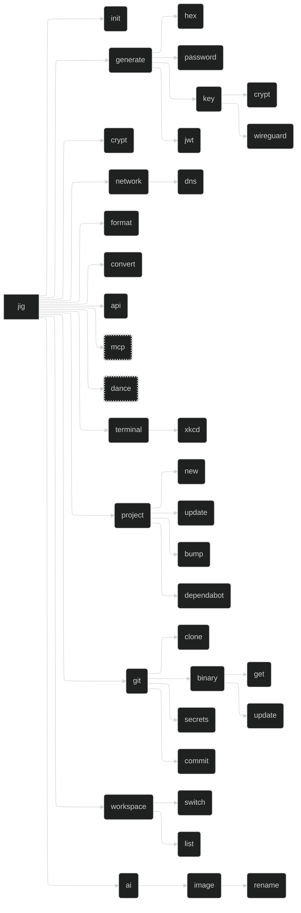

# `jig` - A CLI Toolbox

## Project

`jig` is a utility which collects tools for various tasks into one place. It merges all my disparate tools into a single CLI toolbox, making it easier to manage and use them, and teaches me Rust.

## Layout

- Base CLI framework with `clap`
  - <https://github.com/clap-rs/clap>
- Terminal UI with `ratatui`
  - <https://github.com/ratatui/ratatui>
- Terminal spinners from `spinoff`
  - <https://github.com/ad4mx/spinoff>
- MCP server with `rust-mcp-sdk`
  - <https://github.com/rust-mcp-stack/rust-mcp-sdk>
  - Also `rmcp`
    - <https://github.com/modelcontextprotocol/rust-sdk>
    - <https://hackmd.io/@Hamze/SytKkZP01l>
- [Easter Egg](#easter-egg) with ludicrous effects
- Encryption and decryption with `rage`
  - <https://github.com/str4d/rage>
- Terminal image support with `viuer`
  - <https://github.com/atanunq/viuer>
- HTTP with `reqwest`
- GitHub with `octocrab`
- Async with `tokio`
- Templating with `tera`
- Git with `git2`

## Command Tree

## MCP Server

`jig` will offer a `stdio` [Model Context Protocol (MCP)](https://modelcontextprotocol.org) server, allowing other tools - particularly AI agents - to interact with `jig` and use its features.

This will be implemented 'eventually'.

The MCP tool may be extended to a remote MCP in future, if I figure out how to compile `jig` to WASM and import it from my [personal site and API](https://github.com/daveio/dave-io) at <https://dave.io>. This would also allow me to provide the <https://dave.io/api> endpoints as MCP endpoints too.

## Easter Egg

- Not present in `--help`.
- Not exposed via MCP.
- Use TachyonFX as the primary effects engine.
- Use TUI-Rain for atmospheric background effects.
- Layer in Firework-RS for explosive moments.
- Use RASCII to convert a photo of yourself into animated ASCII art.
- Add Rusty TermColor typewriter effects for text reveals.
- Finish with Spinoff spinners for loading sequences.

### Invocation

`jig dance`

### Effects

#### Core Effects Engine

`tachyonfx`

- <https://github.com/junkdog/tachyonfx>
- The primary shader-like effects engine for ratatui applications
- A ratatui library for creating shader-like effects in terminal UIs with color transformations, animations, and complex effect combinations

#### Atmospheric Effects

`tui-rain`

- <https://github.com/levilutz/tui-rain>
- Rain and atmospheric effects widget
- A simple stateless ratatui widget that generates various rain effects including Matrix rain, normal rain, snow, and emoji floods

#### Explosive Visual Effects

`firework-rs`

- <https://github.com/Wayoung7/firework-rs>
- ASCII art firework simulator
- A cross-platform ASCII-art firework simulator that provides colorful displays, smooth animations, and a simple particle system

#### ASCII Art Generation

`rascii_art`

- <https://github.com/UTFeight/RASCII>
- Advanced image to ASCII art converter
- An advanced image to ASCII art tool and crate that supports colored ASCII generation, custom dimensions, and multiple character sets including block, emoji, default, russian, and slight variants

#### Text Effects

`rusty-termcolor`

- <https://github.com/rusty-libraries/rusty-termcolor>
- Terminal text formatting and effects
- A lightweight terminal manipulation library that provides color manipulation, text effects (typewriter, loading bar, wiggle, matrix), text formatting, and terminal control functions

#### Progress Indicators

`spinoff`

- <https://github.com/ad4mx/spinoff>
- Terminal spinner library
- An easy-to-use, robust library for displaying spinners in the terminal with over 80 spinner variants, custom colors, and multiple output stream support

## Notes

- `clap` supports command shortening to the point of disambiguation
  - Derive API: `#[command(infer_subcommands = true)]`
- `jig fmt` is an alias for `jig format`
- `tachyonfx` integrates nicely with `ratatui`
- `generate` can be deterministic with `-k` / `--keyed` `[name]`
  - Uses encryption key and `[name]` to generate deterministic output
  - Use `-s` / `--seed` `[value]` to use custom value instead of encryption key
    - Run a KDF on `[value]` to get data to actually use
    - Does BLAKE3 have a compute-hard or memory-hard construction?
    - Are there newer funkier KDFs? Post-quantum ones?
- `init` sets up shell integration for `jig workspace`
- Reimplement `oco` so we don't have to shell out to it as `jig git commit`

## Tool Migration Analysis

### From jig/belt Branch

#### belt (Unified CLI Tool)

**Description**: A comprehensive command-line utility belt with cryptography, DNS, audio, and TLS operations.

**Arguments**: Subcommand-based with global flags

**Options**:

- Global: `-h/--help`, `-V/--version`, `-a/--all`, `-i/--input`, `-o/--output`, `-q/--quiet`, `-s/--silent`, `-r/--recursive`, `-v/--verbose`, `-z/--compress`, `-f/--force`, `-p/--pipe`

**Returns**: JSON output with `-p` flag, formatted terminal output otherwise

**Secrets**: Encryption key stored in config (`~/.config/belt/config.yaml`)

**Remote Dependencies**: DNS servers (configurable, defaults to 1.1.1.1)

**Libraries**:

- Go's x/crypto (ChaCha20Poly1305)
- miekg/dns (DNS operations)
- dhowden/tag (audio metadata)

**Subcommands**:

- `init`: Initialize configuration
- `audio info <path>`: Extract audio metadata
- `crypt random hex/pw`: Generate random data
- `crypt simple encrypt/decrypt`: Symmetric encryption
- `crypt simple key`: Key management
- `crypt wireguard`: Generate WireGuard keypairs
- `generate jwt`: Generate JWT tokens with custom claims and expiration
- `dns flush`: Flush DNS cache
- `dns lookup <query> [type]`: DNS queries
- `dns sec <domain>`: DNSSEC validation
- `domain expiry/ns`: Domain operations (placeholders)
- `tls cert/ciphers`: TLS operations (placeholders)

---

#### JWT Token Generation

**Description**: Generic JWT token generation utility for authentication and API access.

**Arguments**: Subject, description, expiration time, optional custom claims

**Options**:

- `--sub <subject>`: Token subject/scope (e.g., "ai:alt", "api:tokens")
- `--description <text>`: Human-readable token description
- `--expires-in <duration>`: Expiration time (e.g., "1h", "7d", "30m")
- `--claim <key=value>`: Add custom claims to token
- `--secret <secret>`: JWT signing secret (or use config/env)
- `--algorithm <alg>`: Signing algorithm (default: HS256)

**Returns**: Signed JWT token string

**Secrets**: JWT signing secret (configurable)

**Remote Dependencies**: None (local crypto operations)

**Libraries**:

- JWT implementation (jsonwebtoken equivalent)
- Crypto library for HMAC/RSA signing
- Time/duration parsing
- Base64 encoding

**Usage Examples**:

- `jig generate jwt --sub "ai:alt" --expires-in "1h"`
- `jig generate jwt --sub "dashboard" --description "CLI access" --expires-in "7d"`
- `jig generate jwt --sub "custom" --claim "role=admin" --claim "scope=read:write"`

---

#### dave.io API integration

**Description**: HTTP client for personal API providing AI-powered operations, image optimization, token management, and dashboard data.

**Arguments**: Subcommand-based with endpoint-specific parameters

**Options**:

- Global: `--token <JWT>`, `--auth` (auto-generate token), `--local/--remote`, `--dry-run`, `--verbose`, `--quiet`, `--script`
- Endpoint-specific quality settings, file paths, URLs

**Returns**: JSON responses with structured data, images, AI-generated content

**Secrets**: JWT secret for token generation, API tokens for authentication

**Remote Dependencies**: dave.io API (https://dave.io), AI services (Claude), Cloudflare Images

**Libraries**:

- HTTP client (reqwest equivalent)
- JWT generation and validation
- Base64 encoding for file uploads
- JSON parsing

**Endpoints**:

- `api ai alt url/file <input>`: Generate alt-text from images
- `api ai tickets title/description/enrich`: Linear ticket AI operations
- `api images optimise url/file <input>`: Image optimization
- `api tokens info/usage/revoke <uuid>`: Token management
- `api dashboard <name>`: Dashboard data retrieval
- `api ping`: System status and health check

**Authentication Scopes**:

- `ai:alt`: Alt-text generation
- `api:tokens`: Token operations
- `dashboard`: Dashboard access
- Public endpoints: images, tickets, ping

---

#### wipe-workflows

**Description**: Delete all workflow runs for a GitHub repository.

**Arguments**: Repository name (owner/repo)

**Options**: None

**Returns**: Deleted workflow runs

**Secrets**: GitHub token

**Remote Dependencies**: GitHub API

**Libraries**: gh CLI, jq

---

#### yank

**Description**: Fetch and pull all git repositories in current directory.

**Arguments**: None

**Options**: None

**Returns**: Updated repositories

**Secrets**: Git credentials

**Remote Dependencies**: Git remotes

**Libraries**: git

---

#### latest-commit

**Description**: Get the latest commit hash on main for a GitHub repository.

**Arguments**: Repository (owner/repo)

**Options**: None

**Returns**: Commit SHA

**Secrets**: GitHub token

**Remote Dependencies**: GitHub API

**Libraries**: gh CLI

---

### Migration Priority Assessment

#### High Priority (Core Utilities)

1. **hubbit** - Repository and binary management
2. **jig-bump** - Dependency updating across projects
3. **clone-repos/yank** - Parallel repository operations
4. **ws** - Workspace context switching
5. **orphans** - File cleanup utilities
6. **quickcommit** - Smart git commit workflow (most used: 1,721 times)
7. **trunkfix** - Code formatting and checking
8. **dockerclean** - Docker system cleanup
9. **extract** - Universal archive extraction
10. **JWT token generation** - Generic JWT creation for API authentication

#### Medium Priority (Specialized Tools)

11. **dave.io API integration** - Personal API client for AI, images, tokens, and dashboard data
12. **pull-ai** - AI model management
13. **sixkcd** - Terminal entertainment/graphics
14. **mastodon-maintenance** - Server maintenance
15. **lsr** - MIDI/IR integration
16. **devsetup** - Smart project setup
17. **gitclean** - Git repository optimization
18. **github-auth** - GitHub token management
19. **wipe-workflows/delete-issues** - GitHub cleanup
20. **czkawka** - Duplicate file finder
21. **findreplace** - Batch text replacement

#### Low Priority (Project-Specific)

22. **le-fw** - Let's Encrypt for firewall
23. **nas-docker** - NAS Docker configuration
24. **cma/cmae** - Chezmoi integration
25. **js-clear-caches** - JavaScript cache cleanup
26. **kill-oco/psclean** - Process cleanup
27. **latest-commit** - GitHub commit lookup
28. **cc/up/edit** - Shell navigation helpers

### Common Patterns

- **Configuration Management**: Most tools use `~/.config/[tool]/` for settings
- **API Integration**: Heavy reliance on GitHub, package registries, and service APIs
- **Parallel Processing**: Multiple tools implement concurrent operations
- **Cross-Platform**: Go and modern scripting for portability
- **Rich Terminal UI**: Colors, progress bars, structured output options
- **Credential Management**: Various approaches to secrets and tokens
