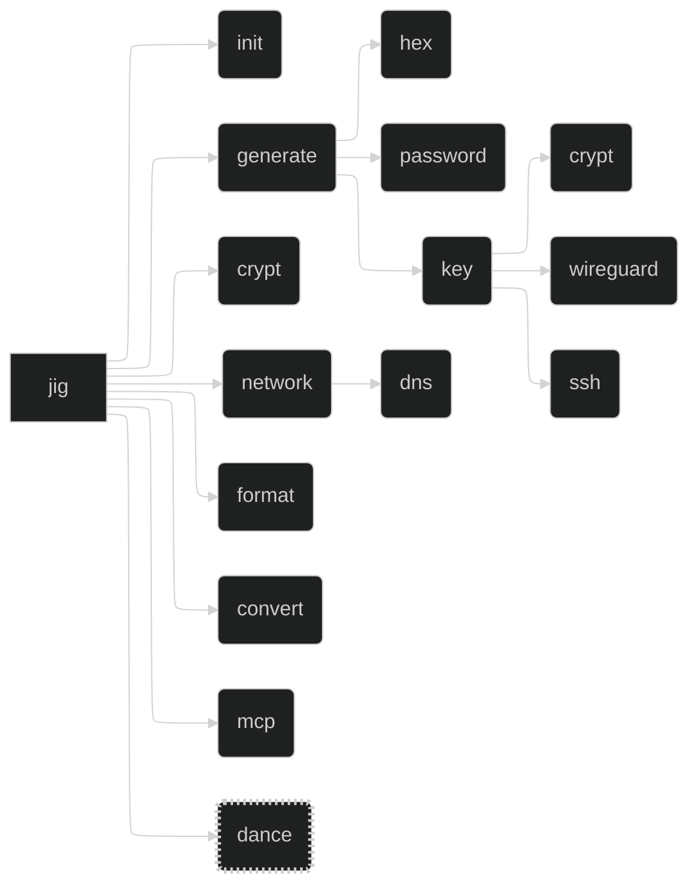

# `jig` - A CLI Toolbox

## Project

`jig` is a utility which collects tools for various tasks into one place. It merges all my disparate tools into a single CLI toolbox, making it easier to manage and use them, and teaches me Rust.

## Layout

- Base CLI framework with `clap`
  - <https://github.com/clap-rs/clap>
- Terminal UI with `ratatui`
  - <https://github.com/ratatui/ratatui>
- Terminal spinners from `spinoff`
  - <https://github.com/ad4mx/spinoff>
- MCP server with `rust-mcp-sdk`
  - <https://github.com/rust-mcp-stack/rust-mcp-sdk>
  - Also `rmcp`
    - <https://github.com/modelcontextprotocol/rust-sdk>
    - <https://hackmd.io/@Hamze/SytKkZP01l>
- [Easter Egg](#easter-egg) with ludicrous effects
- Encryption and decryption with `rage`
  - <https://github.com/str4d/rage>

## Command Tree

## MCP Server

The plan is to also offer a `stdio` [Model Context Protocol (MCP)](https://modelcontextprotocol.org) server, allowing other tools - particularly AI agents - to interact with `jig` and use its features.

The MCP tool may be extended to a remote MCP in future, if I figure out how to compile `jig` to WASM and import it from my [personal site and API](https://github.com/daveio/dave-io) at <https://dave.io>. This would also allow me to provide the <https://dave.io/api> endpoints as MCP endpoints too.

## Easter Egg

- Not present in `--help`.
- Not exposed via MCP.
- Use TachyonFX as the primary effects engine.
- Use TUI-Rain for atmospheric background effects.
- Layer in Firework-RS for explosive moments.
- Use RASCII to convert a photo of yourself into animated ASCII art.
- Add Rusty TermColor typewriter effects for text reveals.
- Finish with Spinoff spinners for loading sequences.

### Invocation

`jig dance`

### Effects

#### Core Effects Engine

`tachyonfx`

- <https://github.com/junkdog/tachyonfx>
- The primary shader-like effects engine for ratatui applications
- A ratatui library for creating shader-like effects in terminal UIs with color transformations, animations, and complex effect combinations

#### Atmospheric Effects

`tui-rain`

- <https://github.com/levilutz/tui-rain>
- Rain and atmospheric effects widget
- A simple stateless ratatui widget that generates various rain effects including Matrix rain, normal rain, snow, and emoji floods

#### Explosive Visual Effects

`firework-rs`

- <https://github.com/Wayoung7/firework-rs>
- ASCII art firework simulator
- A cross-platform ASCII-art firework simulator that provides colorful displays, smooth animations, and a simple particle system

#### ASCII Art Generation

`rascii_art`

- <https://github.com/UTFeight/RASCII>
- Advanced image to ASCII art converter
- An advanced image to ASCII art tool and crate that supports colored ASCII generation, custom dimensions, and multiple character sets including block, emoji, default, russian, and slight variants

#### Text Effects

`rusty-termcolor`

- <https://github.com/rusty-libraries/rusty-termcolor>
- Terminal text formatting and effects
- A lightweight terminal manipulation library that provides color manipulation, text effects (typewriter, loading bar, wiggle, matrix), text formatting, and terminal control functions

#### Progress Indicators

`spinoff`

- <https://github.com/ad4mx/spinoff>
- Terminal spinner library
- An easy-to-use, robust library for displaying spinners in the terminal with over 80 spinner variants, custom colors, and multiple output stream support

## Notes

- `clap` supports command shortening to the point of disambiguation
  - Derive API: `#[command(infer_subcommands = true)]`
- `jig fmt` is an alias for `jig format`
- `tachyonfx` integrates nicely with `ratatui`
- `generate` can be deterministic with `-k` / `--keyed` `[name]`
  - Uses encryption key and `[name]` to generate deterministic output
  - Use `-s` / `--seed` `[value]` to use custom value instead of encryption key
    - Run a KDF on `[value]` to get data to actually use
    - Does BLAKE3 have a compute-hard or memory-hard construction?
    - Are there newer funkier KDFs? Post-quantum ones?

## Tool Migration Analysis

### From jig/belt Branch

#### belt (Unified CLI Tool)

**Description**: A comprehensive command-line utility belt with cryptography, DNS, audio, and TLS operations.

**Arguments**: Subcommand-based with global flags

**Options**:

- Global: `-h/--help`, `-V/--version`, `-a/--all`, `-i/--input`, `-o/--output`, `-q/--quiet`, `-s/--silent`, `-r/--recursive`, `-v/--verbose`, `-z/--compress`, `-f/--force`, `-p/--pipe`

**Returns**: JSON output with `-p` flag, formatted terminal output otherwise

**Secrets**: Encryption key stored in config (`~/.config/belt/config.yaml`)

**Remote Dependencies**: DNS servers (configurable, defaults to 1.1.1.1)

**Libraries**:

- Go's x/crypto (ChaCha20Poly1305)
- miekg/dns (DNS operations)
- dhowden/tag (audio metadata)

**Subcommands**:

- `init`: Initialize configuration
- `audio info <path>`: Extract audio metadata
- `crypt random hex/pw`: Generate random data
- `crypt simple encrypt/decrypt`: Symmetric encryption
- `crypt simple key`: Key management
- `crypt wireguard`: Generate WireGuard keypairs
- `dns flush`: Flush DNS cache
- `dns lookup <query> [type]`: DNS queries
- `dns sec <domain>`: DNSSEC validation
- `domain expiry/ns`: Domain operations (placeholders)
- `tls cert/ciphers`: TLS operations (placeholders)

---

### From jig/old Branch

#### jig (Project Management CLI)

**Description**: Development environment manager for project setup, dependency management, and AI tool configuration.

**Arguments**: Subcommand-based with optional repository paths

**Options**:

- Global: `--dry-run/-d`, `--info/-i`, `--verbose/-v`, `--ai/-a`, `--output/-o`

**Returns**: Project scaffolding, dependency updates, configuration files

**Secrets**: GitHub tokens for API access

**Remote Dependencies**:

- Package registries (npm, PyPI, crates.io, rubygems)
- GitHub API
- Baseline repository (`/Users/dave/src/github.com/daveio/_baseline`)

**Libraries**:

- clap (CLI parsing)
- git2 (Git operations)
- tera (templating)
- reqwest (HTTP)
- octocrab (GitHub API)
- tokio (async runtime)

**Subcommands**:

- `new [language]`: Create new project with templates
- `update [repository]`: Update template files
- `ai [tool]`: Configure AI tools (Claude, Cursor, Zed, Goose)
- `bump [repository]`: Update dependencies across ecosystems
- `dependabot [repository]`: Manage Dependabot configuration

---

### From Other Repositories

#### sixkcd

**Description**: Displays XKCD comics using Sixel graphics as MOTD.

**Arguments**: Optional comic number

**Options**: None

**Returns**: Comic image and alt text displayed in terminal

**Secrets**: None

**Remote Dependencies**: XKCD API

**Libraries**: imagemagick, iTerm2's imgcat/img2sixel, curl/wget

**Source**: `/Users/dave/src/github.com/daveio/dotfiles-fish/tools/sixkcd`

---

#### hubbit

**Description**: Smart Git repository cloning and GitHub release binary management tool.

**Arguments**: Subcommand-based with repository specifications

**Options**: None documented

**Returns**: Cloned repositories, installed binaries in `~/.local/bin`

**Secrets**: GitHub token (optional, for private repos)

**Remote Dependencies**: GitHub API, Git repositories

**Libraries**: Go standard library, GitHub API client

**Commands**:

- `clone [repo]`: Clone with minimal typing
- `binary get [owner/repo]`: Download latest binary
- `binary update [owner/repo]`: Update specific binary
- `binary update`: Update all binaries

---

#### jig-bump (from myriad/bump.ts)

**Description**: Multi-language dependency updater that operates across multiple repositories.

**Arguments**: None (operates on current directory or configured repositories)

**Options**: Configurable via script

**Returns**: Updated package files across projects

**Secrets**: Package registry tokens as needed

**Remote Dependencies**: npm, PyPI, RubyGems registries

**Libraries**: axios, chalk, commander, semver (Node.js)

---

#### clone-repos

**Description**: Parallel Git repository cloning and updating utility.

**Arguments**: Repository list via stdin

**Options**: None

**Returns**: Cloned/updated repositories in parallel

**Secrets**: Git credentials

**Remote Dependencies**: Git repositories

**Libraries**: bash, xargs, git

**Usage**: `./clone-repos.bash < repo-list.txt`

---

#### ws

**Description**: Shell workspace context switcher for managing environment variables and project contexts.

**Arguments**: Workspace name for switch command

**Options**: Subcommand-specific

**Returns**: Modified shell environment

**Secrets**: Workspace-specific environment variables

**Remote Dependencies**: None

**Libraries**: Go standard library

**Commands**:

- `switch [workspace]`: Switch to workspace
- `install`: Set up shell integration
- `list`: List available workspaces

---

#### orphans

**Description**: Find and optionally delete orphaned sidecar files without corresponding media files.

**Arguments**: Directory path

**Options**: `--dry-run`, `--delete`, `--extension`

**Returns**: List of orphaned files, optional deletion

**Secrets**: None

**Remote Dependencies**: None

**Libraries**: rich (Python)

---

#### pull-ai

**Description**: Parallel AI model downloader using tmux sessions.

**Arguments**: None (hardcoded model list)

**Options**: None

**Returns**: Downloaded AI models via ollama

**Secrets**: None

**Remote Dependencies**: Ollama model registry

**Libraries**: tmux, ollama

---

#### lsr

**Description**: 'Lightswitch Rave': MIDI clock receiver for Broadlink IR device control.

**Arguments**: None (daemon-style)

**Options**: BPM configuration via environment

**Returns**: IR commands sent to devices

**Secrets**: Broadlink device credentials

**Remote Dependencies**: Network-connected IR devices

**Libraries**: broadlink, python-rtmidi

---

#### mastodon-maintenance

**Description**: Automated Mastodon server maintenance tasks.

**Arguments**: None

**Options**: None

**Returns**: Cleaned cache and removed orphaned media

**Secrets**: Mastodon database credentials

**Remote Dependencies**: Mastodon server

**Libraries**: tootctl, Rails environment

---

#### `ai-screenshot-renamer`

**Description**: Rename screenshots based on AI-generated titles.

**Arguments**: None

**Options**: None

**Returns**: None, renames files

**Secrets**: None

**Remote Dependencies**: Claude AI

**Libraries**: Python: `anthropic`

**Scripts**: `ai-screenshot-renamer.py`

---

### From Fish Functions (~/.config/fish/funcs.fish)

#### nas-docker

**Description**: Set up Docker to use the NAS.

**Arguments**: None

**Options**: None

**Returns**: Sets environment variables for Docker

**Secrets**: Docker TLS certificates

**Remote Dependencies**: NAS Docker daemon (tcp://nas-7t54.manticore-minor.ts.net:2376)

**Libraries**: None (fish function)

---

#### le-fw

**Description**: Set up Let's Encrypt certificates for the firewall with multiple domains.

**Arguments**: None

**Options**: Hardcoded lego options

**Returns**: Generated certificates in PEM and PFX formats

**Secrets**: DNS Simple API credentials

**Remote Dependencies**: DNS Simple API, Let's Encrypt ACME

**Libraries**: lego

---

#### cma/cmae

**Description**: Add files to chezmoi configuration management (with optional encryption).

**Arguments**: File paths

**Options**: None

**Returns**: Files added to chezmoi

**Secrets**: chezmoi encryption key (for cmae)

**Remote Dependencies**: None

**Libraries**: chezmoi

---

#### github-auth

**Description**: Authenticate with GitHub and set GITHUB_TOKEN environment variable.

**Arguments**: None

**Options**: None

**Returns**: Sets GITHUB_TOKEN environment variable

**Secrets**: GitHub authentication token

**Remote Dependencies**: GitHub API

**Libraries**: gh CLI

---

#### kill-oco

**Description**: Kill hanging opencommit processes.

**Arguments**: None

**Options**: Interactive confirmation

**Returns**: Terminates matching processes

**Secrets**: None

**Remote Dependencies**: None

**Libraries**: None (fish function)

---

#### wipe-workflows

**Description**: Delete all workflow runs for a GitHub repository.

**Arguments**: Repository name (owner/repo)

**Options**: None

**Returns**: Deleted workflow runs

**Secrets**: GitHub token

**Remote Dependencies**: GitHub API

**Libraries**: gh CLI, jq

---

#### delete-issues/delete-issue

**Description**: Delete GitHub issues from repository (single or batch).

**Arguments**: Issue number(s)

**Options**: Parallelism level for batch deletion

**Returns**: Deleted issues

**Secrets**: GitHub token

**Remote Dependencies**: GitHub API

**Libraries**: gh CLI, jq, parallel

---

#### yank

**Description**: Fetch and pull all git repositories in current directory.

**Arguments**: None

**Options**: None

**Returns**: Updated repositories

**Secrets**: Git credentials

**Remote Dependencies**: Git remotes

**Libraries**: git

---

#### js-clear-caches

**Description**: Clear all JavaScript package manager caches.

**Arguments**: None

**Options**: None

**Returns**: Cleared caches

**Secrets**: None

**Remote Dependencies**: None

**Libraries**: deno

---

#### czkawka

**Description**: Run czkawka or krokiet duplicate finder tools.

**Arguments**: Pass-through to tool

**Options**: Interactive choice between tools

**Returns**: Tool output

**Secrets**: None

**Remote Dependencies**: None

**Libraries**: czkawka/krokiet binaries

---

#### latest-commit

**Description**: Get the latest commit hash on main for a GitHub repository.

**Arguments**: Repository (owner/repo)

**Options**: None

**Returns**: Commit SHA

**Secrets**: GitHub token

**Remote Dependencies**: GitHub API

**Libraries**: gh CLI

---

#### psclean

**Description**: Clean up commonly hanging processes and restart 1Password.

**Arguments**: None

**Options**: None

**Returns**: Killed processes

**Secrets**: None

**Remote Dependencies**: None

**Libraries**: None (fish function)

---

#### quickcommit

**Description**: Smart git commit with AI-generated messages and optional push.

**Arguments**: None

**Options**: `-p/--push`, `-m/--message`

**Returns**: Git commit (and optional push)

**Secrets**: None

**Remote Dependencies**: Git remote (for push)

**Libraries**: git, oco

---

#### trunkfix

**Description**: Run trunk fmt and check commands in sequence.

**Arguments**: None

**Options**: `-f/--fix`

**Returns**: Formatted and checked code

**Secrets**: None

**Remote Dependencies**: None

**Libraries**: trunk

---

#### devsetup

**Description**: Smart development environment setup detecting project type.

**Arguments**: None

**Options**: None

**Returns**: Installed dependencies and starts dev server

**Secrets**: Package registry tokens as needed

**Remote Dependencies**: Package registries

**Libraries**: bun, pnpm, npm, bundle, pip, cargo

---

#### gitclean

**Description**: Comprehensive git repository cleanup and optimization.

**Arguments**: None

**Options**: None

**Returns**: Cleaned git repository

**Secrets**: None

**Remote Dependencies**: Git remote

**Libraries**: git

---

#### dockerclean

**Description**: Clean up Docker containers, images, networks, and volumes.

**Arguments**: None

**Options**: `-a/--all`, `-f/--force`

**Returns**: Freed disk space

**Secrets**: None

**Remote Dependencies**: None

**Libraries**: docker

---

#### cc

**Description**: Clear screen and optionally run command.

**Arguments**: Optional command to run

**Options**: None

**Returns**: Cleared screen and command output

**Secrets**: None

**Remote Dependencies**: None

**Libraries**: None (fish function)

---

#### up

**Description**: Go up multiple directories.

**Arguments**: Number of levels (default: 1)

**Options**: None

**Returns**: Changed directory path

**Secrets**: None

**Remote Dependencies**: None

**Libraries**: None (fish function)

---

#### edit

**Description**: Smart editor selection based on available editors.

**Arguments**: Optional files to edit

**Options**: None

**Returns**: Opens editor

**Secrets**: None

**Remote Dependencies**: None

**Libraries**: code, zed, nvim

---

#### extract

**Description**: Extract various archive formats automatically.

**Arguments**: Archive file path

**Options**: None

**Returns**: Extracted files

**Secrets**: None

**Remote Dependencies**: None

**Libraries**: tar, bunzip2, unrar, gunzip, unzip, uncompress, 7z

---

#### findreplace

**Description**: Find and replace text in files recursively.

**Arguments**: Search term, replace term, optional directory

**Options**: `-e/--ext` for file extension filter

**Returns**: Modified files

**Secrets**: None

**Remote Dependencies**: None

**Libraries**: find, sed

---

### Migration Priority Assessment

#### High Priority (Core Utilities)

1. **hubbit** - Repository and binary management
2. **jig-bump** - Dependency updating across projects
3. **clone-repos/yank** - Parallel repository operations
4. **ws** - Workspace context switching
5. **orphans** - File cleanup utilities
6. **quickcommit** - Smart git commit workflow (most used: 1,721 times)
7. **trunkfix** - Code formatting and checking
8. **dockerclean** - Docker system cleanup
9. **extract** - Universal archive extraction

#### Medium Priority (Specialized Tools)

10. **pull-ai** - AI model management
11. **sixkcd** - Terminal entertainment/graphics
12. **mastodon-maintenance** - Server maintenance
13. **lsr** - MIDI/IR integration
14. **devsetup** - Smart project setup
15. **gitclean** - Git repository optimization
16. **github-auth** - GitHub token management
17. **wipe-workflows/delete-issues** - GitHub cleanup
18. **czkawka** - Duplicate file finder
19. **findreplace** - Batch text replacement

#### Low Priority (Project-Specific)

20. **le-fw** - Let's Encrypt for firewall
21. **nas-docker** - NAS Docker configuration
22. **cma/cmae** - Chezmoi integration
23. **js-clear-caches** - JavaScript cache cleanup
24. **kill-oco/psclean** - Process cleanup
25. **latest-commit** - GitHub commit lookup
26. **cc/up/edit** - Shell navigation helpers

### Common Patterns

- **Configuration Management**: Most tools use `~/.config/[tool]/` for settings
- **API Integration**: Heavy reliance on GitHub, package registries, and service APIs
- **Parallel Processing**: Multiple tools implement concurrent operations
- **Cross-Platform**: Go and modern scripting for portability
- **Rich Terminal UI**: Colors, progress bars, structured output options
- **Credential Management**: Various approaches to secrets and tokens
