# `jig` - A CLI Toolbox

## Project

`jig` is a utility which collects tools for various tasks into one place. It merges all my disparate tools into a single CLI toolbox, making it easier to manage and use them, and teaches me Rust.

## Command Tree

```mermaid
---
config:
  theme: dark
  layout: elk
---
graph LR
  jig[jig] --> init(init)
  jig --> generate(generate)
    generate --> generateHex(hex)
    generate --> generatePassword(password)
    generate --> generateKey(key)
      generateKey --> generateKeyCrypt(crypt)
      generateKey --> generateKeyWireguard(wireguard)
    generate --> generateJwt(jwt)
  jig --> crypto(crypto)
    crypto --> cryptoEncrypt(encrypt)
    crypto --> cryptoDecrypt(decrypt)
  jig --> network(network)
    network --> networkDns(dns)
      networkDns --> networkDnsFlush(flush)
      networkDns --> networkDnsLookup(lookup)
      networkDns --> networkDnsSec(sec)
  jig --> domain(domain)
    domain --> domainExpiry(expiry)
    domain --> domainWhois(whois)
    domain --> domainNs(ns)
    domain --> domainAvailable(available)
  jig --> tls(tls)
    tls --> tlsCert(cert)
    tls --> tlsCiphers(ciphers)
  jig --> format(format)
  jig --> convert(convert)
  jig --> api(api)
    api --> apiTicket(ticket)
      apiTicket --> apiTicketTitle(title)
      apiTicket --> apiTicketDescription(description)
      apiTicket --> apiTicketEnrich(enrich)
    api --> apiImage(image)
      apiImage --> apiImageAlt(alt)
      apiImage --> apiImageOptimise(optimise)
    api --> apiToken(token)
      apiToken --> apiTokenInfo(info)
      apiToken --> apiTokenRevoke(revoke)
      apiToken --> apiTokenUsage(usage)
    api --> apiDashboard(dashboard)
    api --> apiPing(ping)
  jig --> mcp(mcp)
  jig --> dance(dance)
  jig --> terminal(terminal)
    terminal --> terminalXKCD(xkcd)
  jig --> project(project)
    project --> projectNew(new)
    project --> projectUpdate(update)
    project --> projectBump(bump)
    project --> projectDependabot(dependabot)
  jig --> git(git)
    git --> gitClone(clone)
    git --> gitBinary(binary)
      gitBinary --> gitBinaryGet(get)
      gitBinary --> gitBinaryUpdate(update)
    git --> gitSecrets(secrets)
    git --> gitCommit(commit)
    git --> gitYank(yank)
    git --> gitLatest(latest)
  jig --> workspace(workspace)
    workspace --> workspaceSwitch(switch)
    workspace --> workspaceList(list)
  jig --> ai(ai)
    ai --> aiImage(image)
      aiImage --> aiImageRename(rename)

  style mcp stroke-dasharray: 2 3,stroke-width: 5px
  style dance stroke-dasharray: 2 3,stroke-width: 5px
```

## Commands

[to be stubbed]

## Libraries

- Base CLI framework with `clap`
  - <https://github.com/clap-rs/clap>
- Terminal UI with `ratatui`
  - <https://github.com/ratatui/ratatui>
- Terminal spinners from `spinoff`
  - <https://github.com/ad4mx/spinoff>
- MCP server with `rust-mcp-sdk`
  - <https://github.com/rust-mcp-stack/rust-mcp-sdk>
  - Also `rmcp`
    - <https://github.com/modelcontextprotocol/rust-sdk>
    - <https://hackmd.io/@Hamze/SytKkZP01l>
- [Easter Egg](#easter-egg) uses multiple libraries
- Encryption and decryption with `rage`
  - <https://github.com/str4d/rage>
- Terminal image support with `viuer`
  - <https://github.com/atanunq/viuer>
- HTTP with `reqwest`
- GitHub with `octocrab`
- Async with `tokio`
- Templating with `tera`
- Git with `git2`
- JWT implementation (jsonwebtoken equivalent)
- Crypto library for HMAC/RSA signing
- Time/duration parsing
- Base64 encoding
- JSON, YAML, and TOML parsing and writing (`serde`?)

## Notes

- `clap` supports command shortening to the point of disambiguation
  - Derive API: `#[command(infer_subcommands = true)]`
- `jig fmt` is an alias for `jig format`
- `tachyonfx` integrates nicely with `ratatui`
- `generate` can be deterministic with `-k` / `--keyed` `[name]`
  - Uses encryption key and `[name]` to generate deterministic output
  - Use `-s` / `--seed` `[value]` to use custom value instead of encryption key
    - Run a KDF on `[value]` to get data to actually use
    - Does BLAKE3 have a compute-hard or memory-hard construction?
    - Are there newer funkier KDFs? Post-quantum ones?
- `init` sets up shell integration for `jig workspace`
- Reimplement `oco` so we don't have to shell out to it as `jig git commit`

## JWT Operations

- `--sub <subject>`: Token subject/scope (e.g., "ai:alt", "api:tokens")
- `--description <text>`: Human-readable token description
- `--expires-in <duration>`: Expiration time (e.g., "1h", "7d", "30m")
- `--claim <key=value>`: Add custom claims to token
- `--secret <secret>`: JWT signing secret (or use config/env)
- `--algorithm <alg>`: Signing algorithm (default: HS256)

## MCP Server

`jig` will offer a `stdio` [Model Context Protocol (MCP)](https://modelcontextprotocol.org) server, allowing other tools - particularly AI agents - to interact with `jig` and use its features.

This will be implemented 'eventually'.

The MCP tool may be extended to a remote MCP in future, if I figure out how to compile `jig` to WASM and import it from my [personal site and API](https://github.com/daveio/dave-io) at <https://dave.io>. This would also allow me to provide the <https://dave.io/api> endpoints as MCP endpoints too.

## Easter Egg

- Not present in `--help`.
- Not exposed via MCP.
- Use TachyonFX as the primary effects engine.
- Use TUI-Rain for atmospheric background effects.
- Layer in Firework-RS for explosive moments.
- Use RASCII to convert a photo of yourself into animated ASCII art.
- Add Rusty TermColor typewriter effects for text reveals.
- Finish with Spinoff spinners for loading sequences.

### Invocation

`jig dance`

### Effects

#### Core Effects Engine

`tachyonfx`

- <https://github.com/junkdog/tachyonfx>
- The primary shader-like effects engine for ratatui applications
- A ratatui library for creating shader-like effects in terminal UIs with color transformations, animations, and complex effect combinations

#### Atmospheric Effects

`tui-rain`

- <https://github.com/levilutz/tui-rain>
- Rain and atmospheric effects widget
- A simple stateless ratatui widget that generates various rain effects including Matrix rain, normal rain, snow, and emoji floods

#### Explosive Visual Effects

`firework-rs`

- <https://github.com/Wayoung7/firework-rs>
- ASCII art firework simulator
- A cross-platform ASCII-art firework simulator that provides colorful displays, smooth animations, and a simple particle system

#### ASCII Art Generation

`rascii_art`

- <https://github.com/UTFeight/RASCII>
- Advanced image to ASCII art converter
- An advanced image to ASCII art tool and crate that supports colored ASCII generation, custom dimensions, and multiple character sets including block, emoji, default, russian, and slight variants

#### Text Effects

`rusty-termcolor`

- <https://github.com/rusty-libraries/rusty-termcolor>
- Terminal text formatting and effects
- A lightweight terminal manipulation library that provides color manipulation, text effects (typewriter, loading bar, wiggle, matrix), text formatting, and terminal control functions

#### Progress Indicators

`spinoff`

- <https://github.com/ad4mx/spinoff>
- Terminal spinner library
- An easy-to-use, robust library for displaying spinners in the terminal with over 80 spinner variants, custom colors, and multiple output stream support
