# `jig` - A CLI Toolbox

## Project

`jig` is a utility which collects tools for various tasks into one place. It merges all my disparate tools into a single CLI toolbox, making it easier to manage and use them, and teaches me Rust.

## Command Tree

```mermaid
---
config:
  theme: dark
  layout: elk
---
graph LR
  jig[jig] --> init(init)
  jig --> crypto(crypto)
    crypto --> cryptoEncrypt(encrypt)
    crypto --> cryptoDecrypt(decrypt)
    crypto --> cryptoPublic(public)
  jig --> generate(generate)
    generate --> generateHex(hex)
    generate --> generatePassword(password)
    generate --> generateKey(key)
      generateKey --> generateKeyCrypto(crypto)
      generateKey --> generateKeyWireguard(wireguard)
    generate --> generateJwt(jwt)
  jig --> network(network)
    network --> networkDns(dns)
      networkDns --> networkDnsFlush(flush)
      networkDns --> networkDnsLookup(lookup)
      networkDns --> networkDnsSec(sec)
  jig --> domain(domain)
    domain --> domainExpiry(expiry)
    domain --> domainWhois(whois)
    domain --> domainNs(ns)
    domain --> domainAvailable(available)
  jig --> tls(tls)
    tls --> tlsCert(cert)
    tls --> tlsCiphers(ciphers)
  jig --> format(format)
  jig --> convert(convert)
  jig --> api(api)
    api --> apiTicket(ticket)
      apiTicket --> apiTicketTitle(title)
      apiTicket --> apiTicketDescription(description)
      apiTicket --> apiTicketEnrich(enrich)
    api --> apiImage(image)
      apiImage --> apiImageAlt(alt)
      apiImage --> apiImageOptimise(optimise)
    api --> apiToken(token)
      apiToken --> apiTokenInfo(info)
      apiToken --> apiTokenRevoke(revoke)
      apiToken --> apiTokenUsage(usage)
    api --> apiDashboard(dashboard)
    api --> apiPing(ping)
  jig --> mcp(mcp)
  jig --> dance(dance)
  jig --> terminal(terminal)
    terminal --> terminalXKCD(xkcd)
  jig --> project(project)
    project --> projectNew(new)
    project --> projectUpdate(update)
    project --> projectBump(bump)
    project --> projectDependabot(dependabot)
  jig --> git(git)
    git --> gitClone(clone)
    git --> gitBinary(binary)
      gitBinary --> gitBinaryGet(get)
      gitBinary --> gitBinaryUpdate(update)
    git --> gitSecrets(secrets)
    git --> gitCommit(commit)
    git --> gitYank(yank)
    git --> gitLatest(latest)
  jig --> workspace(workspace)
    workspace --> workspaceSwitch(switch)
    workspace --> workspaceList(list)
    workspace --> workspaceHook(hook)
  jig --> ai(ai)
    ai --> aiRename(rename)
      aiRename --> aiRenameImage(image)

  style dance stroke-dasharray: 2 3,stroke-width: 5px
```

## Library Notes

- `rmcp`
  - <https://hackmd.io/@Hamze/SytKkZP01l>
- `serde`
  - YAML: <https://lib.rs/crates/saphyr>
  - Other formats: <https://serde.rs/#data-formats>
- `spinoff`
  - `noise`: single character fade spinner
  - `aesthetic`: multi character spinner

## Commands

`clap` supports command shortening to the point of disambiguation.

Derive API: `#[command(infer_subcommands = true)]`

### `jig init`

`-c` / `--clobber` : Overwrite existing config (with a new key!)

Creates initial config file. Also sets up shell integration for `jig workspace`.

### `jig generate`

Generation utilities for various data types.

`generate` can be deterministic with `-k` / `--keyed` `[name]`

- Uses encryption key and `[name]` to generate deterministic output
- Use `-s` / `--seed` `[value]` to use custom value instead of encryption key
  - Run `argon2` on `[value]` to get data to actually use

#### `jig generate hex`

Generate cryptographically secure random hexadecimal values.

#### `jig generate password`

Generate cryptographically secure random passwords.

Alphabet: `A-Z`, `a-z`, `0-9`, `@%^-_,.~`

#### `jig generate key`

Generate cryptographic keys.

##### `jig generate key crypto`

Generate encryption keys for native `age`-based encryption.

##### `jig generate key wireguard`

Generate WireGuard private and public keys.

#### `jig generate jwt`

Generate JSON Web Tokens.

Applies random UUID as token ID.

- `--subject [subject]`: Token subject/scope (e.g., "ai:alt", "api:tokens")
- `--description [text]`: Human-readable token description
- `--expiry [duration]`: Expiration time (e.g., "1h", "7d", "30m")
- `--claim [key=value]`: Add custom claims to token
- `--secret [secret]`: JWT signing secret (or use config/env)
- `--algorithm [alg]`: Signing algorithm (default: HS256)

### `jig crypto`

Encryption and decryption operations.

#### `jig crypto encrypt`

Encrypt data using rage encryption.

#### `jig crypto decrypt`

Decrypt data using rage encryption.

#### `jig crypto public`

Prints the public key associated with your configured private key.

### `jig network`

Network utilities and diagnostics.

#### `jig network dns`

DNS operations and utilities.

##### `jig network dns flush`

Flush DNS cache.

##### `jig network dns lookup`

Perform DNS lookups.

##### `jig network dns sec`

DNS security operations.

### `jig domain`

Domain management and information tools.

#### `jig domain expiry`

Check domain expiration dates.

#### `jig domain whois`

Perform WHOIS lookups.

#### `jig domain ns`

Check nameserver information.

#### `jig domain available`

Check domain availability.

### `jig tls`

TLS/SSL utilities and diagnostics.

#### `jig tls cert`

Certificate operations and analysis.

#### `jig tls ciphers`

Cipher suite analysis.

### `jig format`

Data formatting operations. (Alias: `jig fmt`)

### `jig convert`

Data conversion utilities.

### `jig api`

API operations and utilities.

#### `jig api ticket`

Ticket management operations.

##### `jig api ticket title`

Generate ticket titles.

##### `jig api ticket description`

Generate ticket descriptions.

##### `jig api ticket enrich`

Enrich ticket information.

#### `jig api image`

Image processing operations.

##### `jig api image alt`

Generate alt text for images.

##### `jig api image optimise`

Optimize image files.

#### `jig api token`

Token management operations.

##### `jig api token info`

Get token information.

##### `jig api token revoke`

Revoke tokens.

##### `jig api token usage`

Check token usage.

#### `jig api dashboard`

Dashboard operations.

#### `jig api ping`

API health checks.

### `jig mcp`

Model Context Protocol server functionality.

`jig` will offer a `stdio` [Model Context Protocol (MCP)](https://modelcontextprotocol.org) server, allowing other tools - particularly AI agents - to interact with `jig` and use its features.

This will be implemented 'eventually'.

The MCP tool may be extended to a remote MCP in future, if I figure out how to compile `jig` to WASM and import it from my [personal site and API](https://github.com/daveio/dave-io) at <https://dave.io>. This would also allow me to provide the <https://dave.io/api> endpoints as MCP endpoints too.

### `jig dance`

Easter egg command with terminal effects.

- Not present in `--help`.
- Not exposed via MCP.
- Use TachyonFX as the primary effects engine.
- Use TUI-Rain for atmospheric background effects.
- Layer in Firework-RS for explosive moments.
- Use RASCII to convert a photo of yourself into animated ASCII art.
- Add Rusty TermColor typewriter effects for text reveals.
- Finish with Spinoff spinners for loading sequences.
- `tachyonfx` integrates nicely with `ratatui`.

#### Effects

##### Core Effects Engine

`tachyonfx`

- <https://github.com/junkdog/tachyonfx>
- The primary shader-like effects engine for ratatui applications
- A ratatui library for creating shader-like effects in terminal UIs with color transformations, animations, and complex effect combinations

##### Atmospheric Effects

`tui-rain`

- <https://github.com/levilutz/tui-rain>
- Rain and atmospheric effects widget
- A simple stateless ratatui widget that generates various rain effects including Matrix rain, normal rain, snow, and emoji floods

##### Explosive Visual Effects

`firework-rs`

- <https://github.com/Wayoung7/firework-rs>
- ASCII art firework simulator
- A cross-platform ASCII-art firework simulator that provides colorful displays, smooth animations, and a simple particle system

##### ASCII Art Generation

`rascii_art`

- <https://github.com/UTFeight/RASCII>
- Advanced image to ASCII art converter
- An advanced image to ASCII art tool and crate that supports colored ASCII generation, custom dimensions, and multiple character sets including block, emoji, default, russian, and slight variants

##### Text Effects

`rusty-termcolor`

- <https://github.com/rusty-libraries/rusty-termcolor>
- Terminal text formatting and effects
- A lightweight terminal manipulation library that provides color manipulation, text effects (typewriter, loading bar, wiggle, matrix), text formatting, and terminal control functions

##### Progress Indicators

`spinoff`

- <https://github.com/ad4mx/spinoff>
- Terminal spinner library
- An easy-to-use, robust library for displaying spinners in the terminal with over 80 spinner variants, custom colors, and multiple output stream support

### `jig terminal`

Terminal utilities and enhancements.

#### `jig terminal xkcd`

Display XKCD comics in terminal.

### `jig project`

Project management utilities.

#### `jig project new`

Create new projects.

#### `jig project update`

Update project dependencies.

#### `jig project bump`

Bump project versions.

#### `jig project dependabot`

Dependabot configuration.

### `jig git`

Git utilities and enhancements.

#### `jig git clone`

Enhanced git cloning.

#### `jig git binary`

Binary file management.

##### `jig git binary get`

Retrieve binary files.

##### `jig git binary update`

Update binary files.

#### `jig git secrets`

Secret scanning and management.

#### `jig git commit`

AI-assisted commit messages.

Reimplement `oco` so we don't have to shell out to it.

#### `jig git yank`

Yank/remove commits.

#### `jig git latest`

Get latest repository information.

### `jig workspace`

Workspace management and switching.

#### `jig workspace switch`

Switch between workspaces.

#### `jig workspace list`

List available workspaces.

#### `jig workspace hook`

`[SHELL]`: Shell; we support `bash`, `zsh`, and `fish`.

Used to hook into the user's shell by executing whenever the prompt renders. Not generally called by a human.

### `jig ai`

AI-powered utilities.

#### `jig ai rename`

AI renaming operations.

##### `jig ai rename image`

AI-powered image renaming.

We need to get the image below 5 MB for Claude. Use `-a` / `--api` to use the API with a fresh JWT, or internal image optimisation otherwise.
