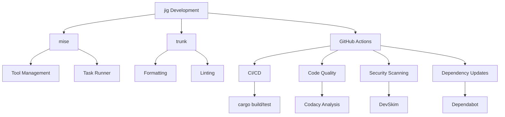

# jig

A tool to manage various aspects of a development environment.

_[imagine a drawing of a small fox using a jig to perfectly align pieces of code]_

## Features

- Auto-detect languages, package managers, and configurations
- Create new repositories with best practices and templates
- Update repositories from templates
- Configure AI tools with best practices
- Bump dependencies to latest versions
- Update GitHub Actions workflows
- Manage Dependabot configuration

## Installation

### From Source

```bash
git clone https://github.com/daveio/jig.git
cd jig
cargo install --path .
```

## Dependency Information

`jig` uses the following key dependencies:

- `clap`: 4.5.38 - Command line argument parsing
- `tera`: 1.20.0 - Template rendering
- `git2`: 0.20.2 - Git operations
- `yaml-rust2`: 0.10.2 - YAML parsing
- `anyhow` and `thiserror`: 1.0.98/2.0.12 - Error handling

## Usage

### Creating a New Repository

```bash
jig new rust
```

This command will:

1. Initialize a Git repository
2. Create a basic project structure for the specified language
3. Set up CI/CD with GitHub Actions
4. Commit the changes

Supported languages:

- Rust
- Python
- JavaScript
- TypeScript
- Go
- Java
- Ruby
- PHP (coming soon)
- C# (coming soon)
- C++ (coming soon)
- C (coming soon)
- Shell (coming soon)

### Updating a Repository

```bash
jig update
```

This command will update the current repository from the template. You can also specify a different repository:

```bash
jig update /path/to/repo
```

### Setting Up AI Support

```bash
jig ai
```

This will configure all supported AI tools. You can also specify a single tool:

```bash
jig ai cursor
```

Supported AI tools:

- Claude Desktop
- Cursor
- Zed
- Goose

### Bumping Versions

```bash
jig bump
```

This command will:

1. Detect package managers in the repository
2. Update dependencies to the latest versions
3. Migrate to modern package managers if needed (e.g., Python projects to `uv`)
4. Update GitHub Actions workflows to the latest versions
5. Commit the changes

You can also target specific ecosystems:

```bash
jig bump --ecosystem node   # Update Node.js/npm packages
jig bump --ecosystem python # Update Python packages
jig bump --ecosystem rust   # Update Rust packages
jig bump --ecosystem ruby   # Update Ruby packages
jig bump --ecosystem java   # Update Java packages
jig bump --ecosystem go     # Update Go packages
jig bump --ecosystem actions # Update GitHub Actions only
```

### Managing Dependabot Configuration

```bash
jig dependabot
```

This command will:

1. Detect all package ecosystems in your repository
2. Create or update `.github/dependabot.yml` configuration
3. Add configurations for any missing ecosystems
4. Set up daily update schedules for dependencies

You can specify a different repository:

```bash
jig dependabot /path/to/repo
```

## Templates and Sharing

`jig` uses a clever template system with shared components to avoid duplication. Templates are organized like this:

```plaintext
templates/
├── shared/             # Shared components
│   ├── gitignore/      # Common gitignore patterns
│   └── github/         # Shared GitHub workflows
├── rust/               # Rust-specific templates
├── python/             # Python-specific templates
└── ... more languages
```

Each language folder contains placeholder files that reference shared components. This means when you update a shared component, all languages get updated! It's like having one fox teach all the other foxes at once!

### Template File Naming

In templates, we avoid using template syntax directly in filenames. Instead:

1. We use placeholders like `PROJECT_NAME` in filenames where dynamic content is needed
2. The actual template logic is handled in the code, which translates these placeholders based on the project context
3. Template logic is still used within the file contents where appropriate

This approach ensures better maintainability and cleaner template organization while still allowing for dynamic file generation.

### Recent Template System Improvements

The template system has been reorganized to better support sharing components across languages:

1. **Common components extraction**: Patterns shared across multiple languages are now stored in dedicated files
2. **Placeholder system**: Simple text files reference these shared components
3. **No template logic in filenames**: Filenames now use placeholders instead of template syntax
4. **Logic extracted to template files**: The actual template logic now resides in the content of files

These changes make templates more maintainable and reduce duplication. The code has been fully updated to support this new system while maintaining backward compatibility.

_[imagine a drawing of foxes celebrating around a shared component tree, each holding a different language flag]_

## Global Options

All commands support these global options:

```bash
--dry-run, -d    # Run in dry-run mode (only explain what would be changed)
--info, -i       # Show information about changes without making them
--verbose, -v    # Show detailed information during execution
--ai, -a         # Format output for AI consumption (requires --info)
--output, -o     # Redirect output to a file
```

## Development

### Project Infrastructure



### Development Environment

The project uses `mise` for tool management and task running. Available tasks:

```bash
mise build   # Build the project
mise test    # Run tests
mise fmt     # Format code using trunk
mise lint    # Lint code using trunk
mise ci      # Run fmt, lint, and test
mise start   # Run the project
```

### Code Quality Tools

- **Trunk**: Multi-language linter aggregator and formatter
- **Codacy**: Automated code review and quality analysis
- **DevSkim**: Security-focused static analysis
- **Dependabot**: Automated dependency updates

### Contributing

1. Fork the repository
2. Create a feature branch
3. Make your changes
4. Run `mise ci` to ensure code quality
5. Submit a pull request

## License

MIT
